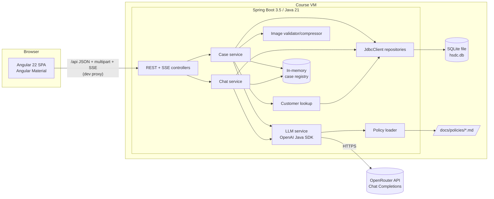
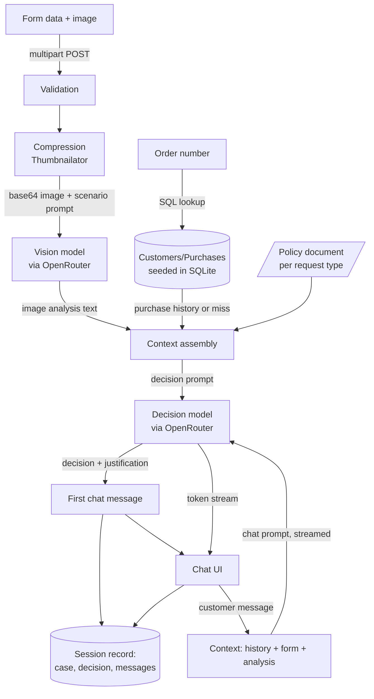
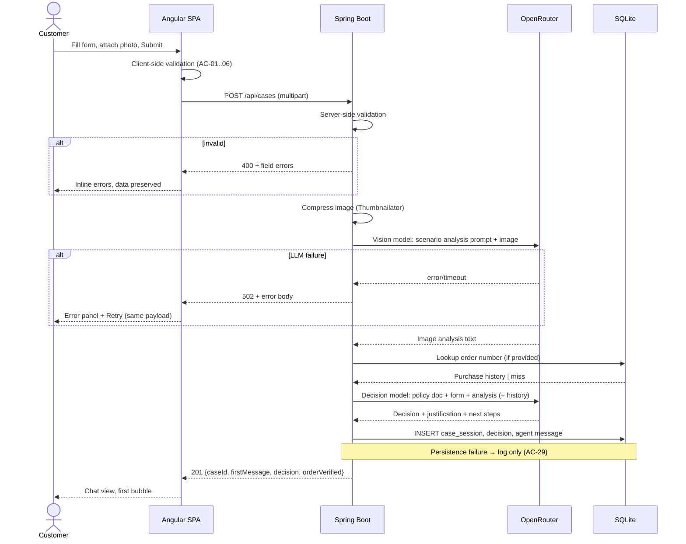
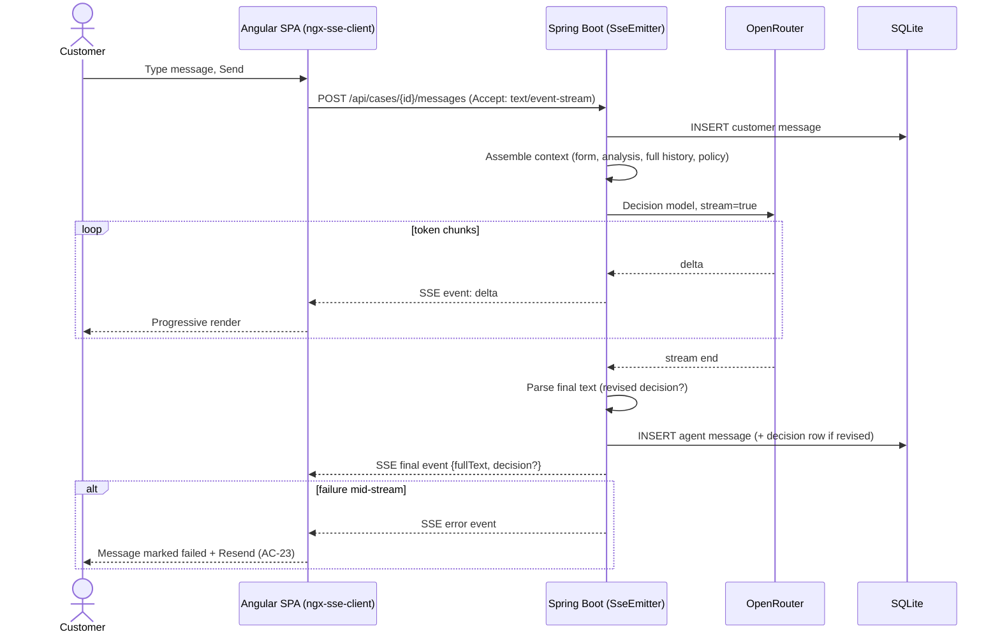

# ADR: Hardware Service Decision Copilot — Main Architecture

**Date:** 2026-07-14
**Status:** Accepted
**PRD:** `docs/PRD.md`

---

## 1. Overview

Hardware Service Decision Copilot (MVP) is a self-service web app: a customer submits a complaint/return form with a photo, a multimodal LLM analyzes the photo, a reasoning LLM issues a policy-grounded decision, and the customer discusses the case in a chat. Every session is persisted to a local SQLite database. This ADR defines the overall architecture; granular ADRs 001–004 cover backend, LLM integration, frontend, and persistence.

This ADR set, together with the PRD, is the complete specification for the implementing agents. Where the PRD defines *what*, these ADRs define *how* at the architectural level — implementation code details come from library docs via Context7.

---

## 2. Context7 Library References

> **Note:** the Context7 MCP server returned an auth error during ADR creation, so handles below follow the standard `/org/repo` convention from the libraries' GitHub coordinates but could not be verified. Verify with `resolve-library-id` before first use; correct here if needed.

| Library | Context7 Handle | Used for |
|---|---|---|
| OpenAI Java SDK | `/openai/openai-java` | All LLM calls (Chat Completions against OpenRouter) |
| Spring Boot | `/spring-projects/spring-boot` | Backend framework |
| Spring Framework | `/spring-projects/spring-framework` | JdbcTemplate/JdbcClient, SseEmitter, MVC |
| Angular | `/angular/angular` | Frontend framework |
| Angular Material | `/angular/components` | UI component library |
| SQLite JDBC | `/xerial/sqlite-jdbc` | JDBC driver for the local SQLite database |
| Thumbnailator | `/coobird/thumbnailator` | Server-side image compression |
| ngx-markdown | `/jfcere/ngx-markdown` | Rendering agent markdown in chat bubbles |
| ngx-sse-client | `/flauc/ngx-sse-client` | Consuming SSE streams over POST in Angular |

---

## 3. System Architecture

### Architecture pattern

SPA + REST API: an Angular single-page application talking to a Spring Boot monolith over JSON REST plus one SSE streaming endpoint. The backend is the only component that talks to OpenRouter and to SQLite. No microservices, no message broker, no server-side rendering.

### Repository structure

```
app/
  backend/     Spring Boot app (Maven project, self-contained)
  frontend/    Angular app (Angular CLI project, self-contained)
docs/
  PRD.md
  ADR/
  policies/    return-policy.md, complaint-policy.md (loaded by backend at runtime)
```

- The two apps are built and run independently: backend via Maven (`mvnw spring-boot:run`), frontend via Angular CLI (`ng serve`).
- In development, the Angular dev server proxies `/api/**` to `http://localhost:8080` (proxy config file in `app/frontend`).
- The policy documents in `docs/policies/` are the runtime source of policy truth: the backend reads them from disk (path configurable) so policy edits need no rebuild.

### Technology stack

| Layer | Technology | Reason |
|---|---|---|
| Backend | Java 21 (LTS), Spring Boot 3.5.x, Maven | User decision; 3.5.x is the mature line (4.x released 06/2026 is too fresh for a course MVP); Java 21 fully supported, runs on the VM's JDK 25 |
| Frontend | Angular 22 (current stable), Angular Material | User decision; Material gives forms, date picker, file UX out of the box |
| LLM access | OpenAI Java SDK (`com.openai:openai-java` 4.x) via OpenRouter Chat Completions | Official SDK, custom base URL support, streaming + image input; see ADR-002 for API choice |
| Database | SQLite (file), `sqlite-jdbc` driver, Spring `JdbcClient`/`JdbcTemplate` | Product-owner decision (local SQLite); JDBC chosen over JPA by user decision — no ORM/dialect friction |
| Image processing | Thumbnailator | Simple, well-documented JPEG/PNG downscaling on the JVM; no native deps |
| Streaming | Server-Sent Events (Spring MVC `SseEmitter` → `ngx-sse-client`) | User decision (streaming); SSE is one-directional which matches chat replies; simpler than WebSocket |

---

## 4. Module Structure & Dependencies

Backend packages (single Maven module, package-per-feature-layer):

| Module/package | Responsibility | Depends on | Depended on by |
|---|---|---|---|
| `web` (controllers, DTOs, exception handlers) | REST + SSE endpoints, request validation, error mapping | `case`, `chat` | — (top) |
| `case` (case service) | Orchestrates form processing: image compression → image analysis → customer lookup → decision | `llm`, `customer`, `persistence`, `image` | `web` |
| `chat` (chat service) | Builds conversation context, streams agent replies, detects revised decisions | `llm`, `persistence` | `web` |
| `llm` | OpenAI SDK client config, prompt assembly (4 prompts), OpenRouter calls, response parsing | `policy` | `case`, `chat` |
| `policy` | Loads and caches the two policy documents from disk | — | `llm` |
| `image` | Validation (type/size) and compression | — | `case` |
| `customer` | Order-number lookup against seeded data | `persistence` | `case` |
| `persistence` | JdbcClient repositories: sessions, decisions, messages, customers/purchases | — (only DB) | `case`, `chat`, `customer` |
| `session` (in-memory registry) | Holds active case context (form data, image analysis, history) keyed by case ID | — | `case`, `chat` |

Dependency direction is strictly downward as listed; no package may depend on `web`. Frontend structure is defined in ADR-003.

---

## 5. Data Models

Conceptual models (SQLite schema details in ADR-004):

- **CaseSession** — one submitted form. Fields: id (UUID string), request type (`COMPLAINT`|`RETURN`), equipment category, equipment model, purchase date, order number (nullable), reason (nullable), image analysis result (text), order-verified flag, created-at. Persisted forever (MVP: no retention limit). Parent of Decision and ChatMessage.
- **Decision** — one decision issued by the agent (initial or revised). Fields: id, case id (FK), category (`APPROVE`|`REJECT`|`NEEDS_MORE_INFO`), justification text, full message text, created-at. Many per case; latest by created-at is the valid one.
- **ChatMessage** — one chat message. Fields: id, case id (FK), sender (`CUSTOMER`|`AGENT`), content, created-at. The agent's first (decision) message is stored both as a ChatMessage and a Decision.
- **Customer** — seeded, read-only. Fields: id, name, email.
- **Purchase** — seeded, read-only. Fields: id, customer id (FK), order number (unique), product name, category, purchase date, price.
- **Active case context (in-memory only)** — form data + compressed-image analysis + full message list for an ongoing case; lost on backend restart (acceptable: PRD requires records to survive restart, not live conversations).

---

## 6. API / Interface Contracts

All endpoints under `/api`. No auth. Errors use a consistent JSON error body (machine-readable code + human message). Details and field lists in ADR-001.

| Endpoint | Method | Input | Output | Notes |
|---|---|---|---|---|
| `/api/cases` | POST | multipart: form fields + image file | Case created: case id, first agent message (decision), decision category, order-verified flag | Blocking (non-streaming); performs compress → analyze → lookup → decide; 400 on validation, 502 on LLM failure |
| `/api/cases/{id}/messages` | POST | JSON: message text | SSE stream: token deltas, then a final event with the complete message + optional new decision category | `text/event-stream` response to a POST; 404 unknown case, 502 LLM failure mid-stream signaled as an SSE error event |
| `/api/health` | GET | — | status | Liveness for the course demo |

Validation limits (server-side, mirroring PRD ACs): image JPEG/PNG only, ≤ 5 MB, exactly one file; required fields per AC-01–AC-04; reason required only for complaints.

---

## 7. Environment Variables

The backend maps these to Spring properties; `.env.example` at repo root documents them. The OpenAI SDK's own `OPENAI_*` variables are **not** used — the backend configures the SDK client explicitly from these:

| Variable | Purpose | Required | Example value |
|---|---|---|---|
| `OPENROUTER_API_KEY` | OpenRouter API key (already set on course VMs) | Yes | `sk-or-…` |
| `OPENROUTER_BASE_URL` | OpenRouter API base URL | No (default `https://openrouter.ai/api/v1`) | `https://openrouter.ai/api/v1` |
| `HSDC_VISION_MODEL` | Multimodal model for image analysis | No (default `openai/gpt-4o-mini`) | `openai/gpt-4o-mini` |
| `HSDC_DECISION_MODEL` | Reasoning model for decision + chat | No (default `openai/gpt-4o`) | `openai/gpt-4o` |
| `HSDC_DB_PATH` | SQLite database file path | No (default `./data/hsdc.db`) | `./data/hsdc.db` |
| `HSDC_POLICIES_DIR` | Directory with the two policy markdown files | No (default `../../docs/policies`) | `../../docs/policies` |

Model defaults must be confirmed against the live OpenRouter model catalog at implementation time and adjusted if deprecated.

---

## 8. Technical Decisions

### Chat Completions API over Responses API
**Status:** Accepted
**Date:** 2026-07-14
**Context:** The OpenAI Java SDK supports both Chat Completions and the newer Responses API. All traffic goes through OpenRouter, not OpenAI directly, so OpenRouter's support level decides.
**Decision:** Use the **Chat Completions API**. OpenRouter's `/api/v1/responses` endpoint is documented as **beta with potential breaking changes** and is **exclusively stateless** — no `previous_response_id`, no stored responses — which removes the Responses API's main architectural benefit (server-side conversation state). Chat Completions is OpenRouter's primary, stable API; the SDK supports it "indefinitely" with streaming and image input. We must send full conversation history per request either way.
**Rejected alternatives:**
- OpenRouter Responses API: beta stability risk for zero state benefit; course MVP needs reliability.
- Calling OpenAI directly with Responses API: the course environment provides only `OPENROUTER_API_KEY`.
**Consequences:**
- (+) Stable, fully documented path in both SDK and OpenRouter.
- (+) Straightforward multimodal input (image as message content part) and SSE streaming.
- (−) Conversation history is resent on every chat turn (acceptable at MVP scale).
- (−) Migration effort later if the ecosystem consolidates on Responses.
**Review trigger:** OpenRouter marks its Responses endpoint stable, or a required feature (e.g. encrypted reasoning persistence) exists only there.

### Spring Boot 3.5.x, not 4.x
**Status:** Accepted
**Date:** 2026-07-14
**Context:** Spring Boot 4.1 (June 2026) is current; 3.5.x remains fully supported. The project targets Java 21 on a course VM and will be implemented largely by AI agents.
**Decision:** Use the latest **Spring Boot 3.5.x** patch. Mature ecosystem, maximal third-party compatibility (sqlite-jdbc, springdoc, testing tools), and the largest documentation/example base for implementing agents. Initialize via Spring Initializr (details in ADR-001).
**Rejected alternatives:**
- Spring Boot 4.1: released weeks ago; modularized-starter changes and thinner community/agent knowledge raise course-time risk with no needed feature.
**Consequences:**
- (+) Predictable behavior, abundant references.
- (−) A migration to 4.x is eventually due.
**Review trigger:** 3.5 approaching EOL, or a needed dependency requires Boot 4.

### Two env-configurable models (vision + decision)
**Status:** Accepted
**Date:** 2026-07-14
**Context:** PRD models image analysis and decision-making as two logical steps; user chose two specialized models.
**Decision:** Two OpenRouter model IDs from env (`HSDC_VISION_MODEL`, `HSDC_DECISION_MODEL`). Image analysis calls the vision model once per case; decision and all chat turns use the decision model. Prompt design in ADR-002.
**Rejected alternatives:**
- Single multimodal model: fewer variables, but couples image quality to reasoning quality and blocks per-step cost tuning.
**Consequences:**
- (+) Each step tunable/swappable independently; cheap vision + strong reasoning possible.
- (−) Two failure points; two prompts to maintain per scenario (4 total).
**Review trigger:** A single model demonstrably matches quality at lower cost, or latency of the two-call chain exceeds ~20 s p95.

### SSE for chat streaming; first decision message non-streamed
**Status:** Accepted
**Date:** 2026-07-14
**Context:** User chose streaming replies. The initial form processing is a multi-step pipeline where most latency is not token generation, and its UI is a staged progress indicator, not a chat bubble.
**Decision:** Chat replies stream over SSE (Spring MVC `SseEmitter` on a POST endpoint; Angular consumes via `ngx-sse-client`). The **first** decision message returns complete in the `POST /api/cases` response — the PRD's staged loading UI covers that wait, keeping the pipeline endpoint simple and retryable as a unit.
**Rejected alternatives:**
- WebSocket: bidirectional capability unneeded; more infrastructure for the same UX.
- Streaming the initial decision too: complicates the retry-as-a-unit error contract (AC-22) for marginal benefit.
**Consequences:**
- (+) Progressive rendering where it matters; standard HTTP; dev-server proxy friendly.
- (−) Two response styles for agent messages; frontend needs an SSE client lib since native `EventSource` cannot POST.
**Review trigger:** Requirement for server-initiated messages (e.g. human handoff) → reconsider WebSocket.

### JDBC (JdbcClient) over JPA for SQLite
**Status:** Accepted
**Date:** 2026-07-14
**Context:** SQLite is fixed by product decision; user chose plain JDBC over Spring Data JPA.
**Decision:** Spring's `JdbcClient` (with `JdbcTemplate` underneath) and hand-written SQL against `sqlite-jdbc`. Schema and seed data via Spring SQL init scripts with idempotent DDL. Details in ADR-004.
**Rejected alternatives:**
- Spring Data JPA + Hibernate: SQLite dialect support is community-grade; ORM adds mapping complexity for a 5-table write-mostly schema.
**Consequences:**
- (+) No ORM/dialect friction; SQL is explicit and reviewable.
- (−) Hand-written mapping code; no derived queries.
**Review trigger:** Schema grows past ~10 tables or read-model complexity (session browsing feature) makes an ORM attractive.

### Monorepo with two independent apps, dev-proxy integration
**Status:** Accepted
**Date:** 2026-07-14
**Context:** User chose `app/backend` + `app/frontend` over a Maven-packaged single JAR. Deployment target is the course VM only.
**Decision:** Independent builds; Angular dev server proxies `/api` to `:8080`. No Docker, no production packaging in MVP.
**Rejected alternatives:**
- frontend-maven-plugin single JAR: one artifact, but slower feedback loop and build complexity with no deployment need.
- Docker Compose: nothing to isolate on a single-user VM.
**Consequences:**
- (+) Fast independent dev loops for be-developer and fe-developer agents.
- (−) Two processes to start for a demo; CORS avoided only via the proxy.
**Review trigger:** Any deployment beyond the local VM.

### Build chat UI from Angular Material primitives (no third-party chat component)
**Status:** Accepted
**Date:** 2026-07-14
**Context:** User asked to research ready-to-use chat components for Angular Material. Findings: Angular Material has **no first-party chat component**; Syncfusion and DevExtreme chat components are commercial; Nebular's chat belongs to a different design system (Eva) and would clash with Material; `ngx-chat-ui` and `angular-material-chat-ui` are low-maintenance community projects.
**Decision:** Compose the chat view from Angular Material primitives (list/card, form field, buttons, progress indicators) with a small custom bubble component, and render agent markdown with `ngx-markdown`. SSE consumption via `ngx-sse-client`. Details in ADR-003.
**Rejected alternatives:**
- Syncfusion / DevExtreme Chat: license cost/registration for a course MVP.
- Nebular chat: pulls in a second design system.
- ngx-chat-ui / angular-material-chat-ui: stale maintenance; riskier than ~150 lines of own template.
**Consequences:**
- (+) No extra licenses; visual consistency; full control over the decision-message layout (badge, sections, disclaimer).
- (−) Chat bubble layout, autoscroll, and typing indicator are our code and our tests.
**Review trigger:** Chat UI scope grows (attachments in chat, reactions, virtual scroll for very long histories).

---

## 9. Diagrams

### 9.1 Architecture / Component Diagram



### 9.2 Data Flow Diagram



### 9.3 Sequence Diagrams

#### Form submission and AI decision (happy path + failure)



#### Chat turn with SSE streaming



---

## 10. Testing Strategy

### Philosophy

TDD per repository `AGENTS.md`: write tests from PRD ACs / these ADRs first, watch them fail, implement minimally, keep green while refactoring. Tests are the implementing agent's self-validation. **Scope decision (user):** unit + integration tests only — no automated E2E in the MVP; the app must still be started and manually exercised before each commit (AGENTS.md verification rule). This deviates from the repo's default test-strategy table (E2E row deferred).

### Test layers

| Layer | Type | Scope | Tools |
|---|---|---|---|
| Unit (BE) | Isolated classes, all deps mocked | Validation, compression thresholds, prompt assembly, decision parsing, repositories' SQL (against in-memory/tmp SQLite) | JUnit 5, Mockito, AssertJ |
| Integration (BE) | Spring context, real SQLite tmp file, **LLM stubbed at HTTP level** | Full `POST /api/cases` and chat SSE flows, error mapping, persistence side effects | Spring Boot Test, MockMvc, WireMock (SDK base URL → WireMock) |
| Unit (FE) | Components/services, HTTP mocked | Form validation states, chat rendering incl. decision bubble, SSE service handling | Angular CLI default runner, HttpTestingController |

### Key test scenarios

Cross-cutting (per-area details in ADRs 001–004):

1. **Return happy path** — valid multipart submission; WireMock returns analysis then Approve decision → 201 with first message; case+decision+message rows exist. Edge: order number missing / unknown (AC-15).
2. **Complaint validation** — missing reason → 400 naming the field; same payload with reason → passes (AC-03).
3. **Image constraints** — GIF rejected, 6 MB rejected, 4.9 MB JPEG accepted and compressed payload < original (AC-05/06/09).
4. **Prompt routing** — request type COMPLAINT selects complaint analysis + complaint decision prompts and complaint policy text; RETURN likewise (AC-10/11/13).
5. **LLM failure** — WireMock 500/timeout on either call → 502 error body; nothing half-persisted except what the contract defines; retry with same payload succeeds.
6. **Chat streaming** — stubbed streaming response → SSE deltas then final event; customer and agent messages persisted with correct senders (AC-19/28).
7. **Revised decision** — stubbed reply marked as new decision → new decision row; latest-by-timestamp is returned as current (AC-20/27).
8. **Persistence failure tolerance** — repository throwing on insert does not fail the HTTP request; error logged (AC-29).
9. **Restart durability** — data written, new Spring context on same DB file, rows still readable (AC-30).

### Technical acceptance criteria

- TAC-01: `mvnw verify` (backend) and `ng test` (frontend) pass with zero failures on the course VM.
- TAC-02: Backend integration tests make **no** real network calls — verified by pointing the SDK at WireMock only.
- TAC-03: `POST /api/cases` p95 < 30 s with live OpenRouter models (manual check, demo-grade).
- TAC-04: The SQLite file is created automatically on first start at `HSDC_DB_PATH` with schema and seed data applied idempotently (second start does not error or duplicate seeds).
- TAC-05: With backend down, the frontend shows the PRD's service-failure states — no unhandled console errors.
- TAC-06: `OPENROUTER_API_KEY` is read from the environment only; it appears in no logs, no responses, and no committed file.
