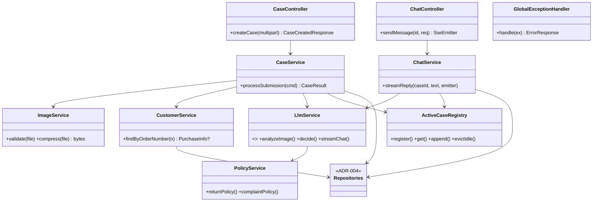
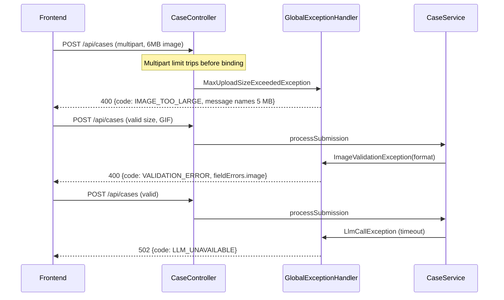

# ADR-001: Backend — Spring Boot Application

**Date:** 2026-07-14
**Status:** Accepted
**Relates to:** `docs/ADR/000-main-architecture.md`

---

## 1. Scope

The Spring Boot application in `app/backend`: project initialization, web layer (REST + SSE), validation, error contract, image handling, and orchestration services. Does NOT cover: LLM prompts and OpenRouter specifics (ADR-002), SQLite schema and repositories (ADR-004), frontend (ADR-003).

---

## 2. Context7 References

| Library | Context7 Handle | Used for |
|---|---|---|
| Spring Boot | `/spring-projects/spring-boot` | App framework, config properties, SQL init, testing |
| Spring Framework | `/spring-projects/spring-framework` | MVC, `SseEmitter`, `JdbcClient`, validation |
| Thumbnailator | `/coobird/thumbnailator` | Image compression |
| WireMock | `/wiremock/wiremock` | HTTP-level LLM stubbing in integration tests |

---

## 3. Component Design

### Project initialization

Generate with **Spring Initializr** (`https://start.spring.io`, via browser or `curl`), then commit the generated skeleton as-is before changes:

- Project: **Maven**, language Java, packaging Jar
- Spring Boot: latest **3.5.x** patch
- Java: **21**
- Group `com.jsystems`, artifact `hsdc-backend`, base package `com.jsystems.hsdc`
- Dependencies selected in Initializr: **Spring Web**, **Validation**, **JDBC API**, **Spring Boot Actuator**
- Added manually to `pom.xml` afterwards: `org.xerial:sqlite-jdbc` (see ADR-004), `com.openai:openai-java` (see ADR-002), `net.coobird:thumbnailator`, `org.wiremock:wiremock` (test scope)

The Maven wrapper (`mvnw`) generated by Initializr is the only required build entry point; no global Maven install assumed on the VM.

### Layers and responsibilities

- **Controllers** (`web`): `CaseController` (`POST /api/cases`), `ChatController` (`POST /api/cases/{id}/messages` returning `SseEmitter`), thin — bind/validate input, delegate, map output.
- **Global exception handler** (`web`): translates validation errors, unknown-case, LLM-failure, and unexpected exceptions into the error contract (Section 5). One handler class; controllers contain no try/catch for these.
- **`CaseService`** (`case`): the pipeline — validate → compress (`ImageService`) → analyze (`LlmService`) → lookup (`CustomerService`) → decide (`LlmService`) → register in `ActiveCaseRegistry` → persist (repositories, failure-tolerant per AC-29). Synchronous; the HTTP request waits.
- **`ChatService`** (`chat`): loads context from `ActiveCaseRegistry`, persists the customer message, invokes streaming LLM call, forwards deltas to the `SseEmitter`, parses the final message for a revised decision, persists agent message (+ decision row when revised).
- **`ImageService`** (`image`): content-type and size validation (reject non-JPEG/PNG, > 5 MB — also enforced by multipart size limits), downscaling via Thumbnailator to the compression target (Section 6 decision), re-encode as JPEG.
- **`ActiveCaseRegistry`** (`session`): concurrent in-memory map caseId → case context (form data, image analysis, message list). Entries evicted after a configurable idle TTL (default 2 h) to bound memory; eviction only removes live-chat ability, records stay in SQLite.
- **`PolicyService`** (`policy`): reads the two markdown files from `HSDC_POLICIES_DIR` at startup, caches contents, fails startup with a clear message if missing.

### State management

The only mutable server state is `ActiveCaseRegistry`. Everything else is stateless services + SQLite. Losing the registry (restart) orphans live chats — acceptable per PRD (no session resume).

---

## 4. Data Structures

DTOs (conceptual):

- **CaseSubmissionRequest** (multipart): requestType (enum), equipmentCategory (enum per AC-08), equipmentModel (string ≤ 200), purchaseDate (ISO date, not future), orderNumber (string ≤ 50, optional), reason (string ≤ 2000, required iff COMPLAINT), image (file part).
- **CaseCreatedResponse**: caseId, decision category, firstMessage (markdown), orderVerified (true/false/not-provided).
- **ChatMessageRequest**: content (string 1..2000).
- **SSE events** (named): `delta` (text chunk), `done` (full text, optional decision category), `error` (error code + message).
- **ErrorResponse**: code (machine string, e.g. `VALIDATION_ERROR`, `IMAGE_TOO_LARGE`, `LLM_UNAVAILABLE`, `CASE_NOT_FOUND`), message (English, user-presentable), fieldErrors (map, only for validation).

---

## 5. Interface Contracts

### `POST /api/cases` — multipart/form-data
- Input: fields above + exactly one `image` part.
- Output `201`: CaseCreatedResponse.
- Errors: `400` VALIDATION_ERROR (fieldErrors filled; covers AC-01..06 server side), `413`→mapped to IMAGE_TOO_LARGE, `502` LLM_UNAVAILABLE (either LLM step failed; safe to retry with identical payload), `500` INTERNAL.
- Retry semantics: idempotency is NOT guaranteed (a retry after a late failure may create a second case); accepted for MVP and noted for the frontend to reuse the same case only from a `201`.

### `POST /api/cases/{id}/messages` — JSON in, `text/event-stream` out
- Input: ChatMessageRequest; `{id}` must exist in `ActiveCaseRegistry`.
- Output: SSE stream of `delta`* then exactly one `done`; on failure one `error` event then stream close.
- Errors before stream start: `404` CASE_NOT_FOUND (also for evicted/restart-lost cases — frontend messaging: start a new case), `400` validation.
- Concurrency: one in-flight reply per case; a second POST while streaming → `409` (frontend prevents this via AC-21 anyway).

### `GET /api/health`
- `200` with status body (Actuator health endpoint exposed under `/api/health` or Actuator default mapped path; exact mapping chosen at implementation).

### Multipart limits
Spring multipart max file size 5 MB and max request size 6 MB, so the 5 MB rule is enforced before controller code runs; the resulting exception maps to IMAGE_TOO_LARGE with the message naming the limit (AC-06).

---

## 6. Technical Decisions

### Synchronous pipeline for case creation
**Status:** Accepted
**Date:** 2026-07-14
**Context:** The pipeline (compress → vision LLM → lookup → decision LLM) takes seconds; alternatives are request/response vs. job + polling vs. streaming progress.
**Decision:** Single blocking request with generous server/client timeouts (120 s); the frontend's staged progress indicator is cosmetic (client-side stages), not driven by server events.
**Rejected alternatives:**
- Async job + polling: extra endpoints and state machine, no UX gain at MVP scale.
- SSE progress events for the pipeline: real staged progress, but complicates the retry-as-a-unit contract (AC-22).
**Consequences:** (+) simplest correct implementation of AC-22; (−) a worker thread is held per in-flight submission (fine single-user).
**Review trigger:** Concurrent submissions > ~20 or p95 > 30 s.

### Image compression target
**Status:** Accepted
**Date:** 2026-07-14
**Context:** AC-09 requires compression before the LLM call; vision models don't benefit from images beyond ~2k px.
**Decision:** Downscale so the longest edge ≤ **1568 px** (common vision-model sweet spot), re-encode JPEG quality 80. Images already smaller pass through re-encoded only if PNG > 1 MB (PNG photos are wastefully large). Implemented with Thumbnailator.
**Rejected alternatives:**
- No compression (violates AC-09); fixed byte budget (needless complexity).
**Consequences:** (+) predictable token/latency cost; (−) fine damage detail could be lost — mitigated by "Needs more info" path.
**Review trigger:** Vision model misses damage visible in originals during course testing.

### Error contract with machine codes
**Status:** Accepted
**Date:** 2026-07-14
**Context:** Frontend must distinguish validation vs. LLM failure vs. unknown case to render the right PRD state.
**Decision:** Uniform ErrorResponse with stable `code` strings (Section 4); HTTP status carries the class, `code` the specifics. SSE failures use the same codes inside the `error` event.
**Rejected alternatives:** Spring's default error body (unstable shape); ProblemDetail RFC 7807 (fine, but fieldErrors extension needed anyway — plain DTO is simpler for the course).
**Consequences:** (+) frontend switches on `code`, tests assert on it; (−) custom handler code to maintain.
**Review trigger:** Public API consumers beyond our SPA → adopt RFC 7807.

### SseEmitter (Spring MVC) rather than WebFlux
**Status:** Accepted
**Date:** 2026-07-14
**Context:** Streaming needs one SSE endpoint; the rest is classic blocking MVC + JDBC.
**Decision:** Stay on Spring MVC; `SseEmitter` fed from the SDK's streaming callback on a dedicated executor. No reactive stack.
**Rejected alternatives:** WebFlux (`Flux<ServerSentEvent>`): reactive programming model for the whole app or an awkward mixed stack; JDBC is blocking anyway.
**Consequences:** (+) one programming model, agent-friendly; (−) one thread per open stream (fine at MVP scale).
**Review trigger:** > ~50 concurrent chat streams.

---

## 7. Diagrams

### Component / Class Diagram

### Sequence Diagram — validation and error mapping

---

## 8. Testing Strategy

### Test scenarios for this area

| Scenario | Type | Input | Expected output | Edge cases |
|---|---|---|---|---|
| Field validation matrix | Unit (validator) + Integration (MockMvc) | Each AC-01..04 violation | 400, fieldErrors names exactly the bad field | reason required flips with requestType; future date |
| Image format/size | Integration | GIF, 6 MB JPEG, 4.9 MB JPEG, 0-byte file | 400/400(413-mapped)/201/400 | file part missing entirely |
| Compression behavior | Unit | 4000×3000 JPEG; 800×600 JPEG; 3 MB PNG | longest edge 1568; passthrough; JPEG re-encode smaller | corrupt image data → VALIDATION_ERROR |
| Pipeline orchestration order | Unit (mocks) | valid command | compress → analyze → lookup → decide call order; registry + repos written | lookup miss → decide still called, orderVerified=false |
| Persistence failure tolerance | Unit | repository insert throws | processSubmission still returns result; error logged | AC-29 |
| SSE happy path | Integration (MockMvc async + WireMock stream stub) | chat POST | delta events then done with full text | done carries decision when stub includes revision |
| SSE error mid-stream | Integration | WireMock breaks connection | single `error` event, emitter completed | customer message still persisted |
| Unknown/evicted case | Integration | POST to random id | 404 CASE_NOT_FOUND | after simulated eviction |
| Concurrent chat message | Integration | 2nd POST while streaming | 409 | — |

### Technical acceptance criteria

- TAC-001-01: `mvnw verify` passes with no test touching the real network (enforced: SDK base URL points at WireMock in every integration test).
- TAC-001-02: Every ErrorResponse `code` value emitted by the handler is covered by at least one test asserting status + code.
- TAC-001-03: App starts with only `OPENROUTER_API_KEY` set (all other env vars defaulted) and serves `/api/health` = UP.
- TAC-001-04: Startup fails fast with a readable message when a policy file is missing (no half-working state).
- TAC-001-05: A 5.0 MB JPEG is accepted; 5.01 MB is rejected with IMAGE_TOO_LARGE (boundary test).
