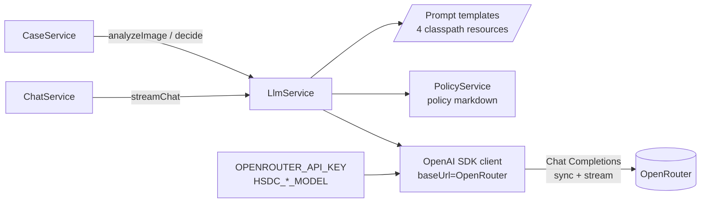
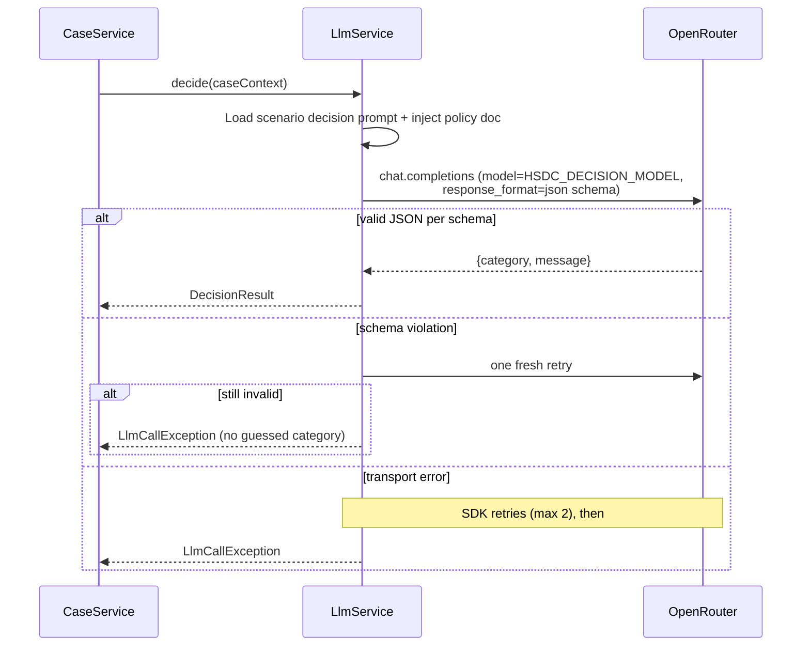
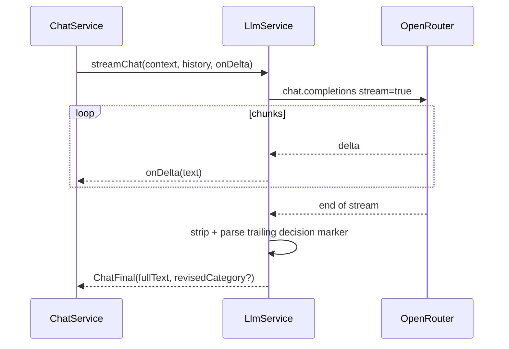

# ADR-002: LLM Integration — OpenAI Java SDK via OpenRouter

**Date:** 2026-07-14
**Status:** Accepted
**Relates to:** `docs/ADR/000-main-architecture.md`

---

## 1. Scope

Everything between `LlmService`'s interface and OpenRouter: SDK client configuration, API choice, the four prompts, multimodal input, structured decision output, streaming, timeouts/retries, and cost/safety controls. Does NOT cover: HTTP endpoints (ADR-001), persistence of results (ADR-004), frontend rendering (ADR-003).

---

## 2. Context7 References

| Library | Context7 Handle | Used for |
|---|---|---|
| OpenAI Java SDK | `/openai/openai-java` | Client, Chat Completions, streaming, image content parts, structured outputs |

External (non-Context7) references for implementers:
- OpenRouter API reference: `https://openrouter.ai/docs/api/reference/overview`
- OpenRouter Responses API (rejected, for context): `https://openrouter.ai/docs/api/reference/responses/overview`
- SDK repo: `https://github.com/openai/openai-java`

---

## 3. Component Design

- **Client configuration:** one singleton SDK client built explicitly (builder), with `baseUrl` = `OPENROUTER_BASE_URL` and `apiKey` = `OPENROUTER_API_KEY`. The SDK's own `OPENAI_API_KEY`/`OPENAI_BASE_URL` env-var auto-detection is not relied on (avoids surprising precedence on shared VMs). Request timeout 120 s; SDK `maxRetries` 2 for transient failures.
- **`LlmService` operations:**
  - `analyzeImage(requestType, formData, compressedImage)` → image analysis text. One Chat Completions call to `HSDC_VISION_MODEL`, user message = text part (scenario analysis prompt with form context) + image part (base64 data URL of the compressed JPEG).
  - `decide(caseContext)` → decision (category + message). One call to `HSDC_DECISION_MODEL`, system prompt = scenario decision prompt with injected policy document; user content = structured case summary (form fields, image analysis, purchase history or "order not verified" note).
  - `streamChat(caseContext, history)` → streaming call to `HSDC_DECISION_MODEL` with the same system prompt plus full message history; deltas forwarded via callback; final text parsed for revised decision.
- **Prompt store:** the four prompt templates live as classpath text resources (not string constants), named `complaint-analysis`, `return-analysis`, `complaint-decision`, `return-decision`. Placeholders for policy text, form fields, analysis, history-related notes. English only.
- **Decision extraction:** decision calls use the SDK's **structured outputs / JSON schema response format** requesting: `category` (enum APPROVE|REJECT|NEEDS_MORE_INFO), `message` (markdown string with greeting, justification, next steps, mandatory disclaimer). Chat streaming replies are free-form markdown, but the system prompt requires that IF the reply changes the decision it must end with a single machine-readable marker line containing the new category; `ChatService` parses that marker (streamed text stays human-readable, category still extractable).

### Prompt content requirements (per PRD §11 and ACs)

- Analysis prompts (vision): complaint → is the item damaged, damage type, plausible causes, confidence; return → signs of usage/damage, resellable-as-new judgment; both → if the image is unusable or shows no electronics, say so explicitly in a detectable phrase (drives AC-17).
- Decision prompts (system): role, the full policy document verbatim, decision rules table from PRD §11, the mandatory disclaimer sentence verbatim, prohibitions (no invented rules, no commitments beyond policy, no legal advice, refuse off-topic), tone spec, output-format instructions (greeting / decision / justification citing a concrete policy rule / next steps / disclaimer).

---

## 4. Data Structures

- **ImageAnalysisResult:** raw analysis text + `usable` flag (derived from the detectable phrase).
- **DecisionResult:** category enum, full markdown message, justification excerpt (for the decision DB row).
- **CaseContext:** requestType, form fields, analysis text, purchaseHistory (nullable), orderVerified tri-state — assembled once by `CaseService`, reused by `ChatService`.
- **ChatDelta / ChatFinal:** streaming callback payloads (text chunk; full text + optional revised category).

---

## 5. Interface Contracts

`LlmService` (consumed by `CaseService`/`ChatService`):

| Operation | Input | Output | Errors |
|---|---|---|---|
| analyzeImage | requestType, form summary, JPEG bytes | ImageAnalysisResult | `LlmCallException` (timeout, 4xx/5xx, malformed reply) |
| decide | CaseContext | DecisionResult | `LlmCallException`; schema-violating reply after retries → exception (never a guessed category) |
| streamChat | CaseContext, history, delta callback | ChatFinal | callback-delivered error; partial text discarded from persistence |

All operations are synchronous from the caller's view (streaming via callbacks on the caller's executor). No other class may touch the SDK.

---

## 6. Technical Decisions

### Chat Completions API, not Responses API (detailed record)
**Status:** Accepted
**Date:** 2026-07-14
**Context:** The user asked for a researched recommendation between the two APIs, with OpenRouter as the mandatory gateway. Research findings: OpenRouter's `/api/v1/responses` endpoint is a drop-in Responses implementation but documented as **beta, subject to breaking changes**, and **exclusively stateless** — no `previous_response_id`, no server-side stored conversation state. OpenAI recommends Responses for new projects *on its own platform* (cache-utilization and feature benefits), and the SDK supports both; Chat Completions is documented as supported indefinitely.
**Decision:** **Chat Completions** for all calls. The two Responses advantages relevant to us (server-side state, platform-native features) are nullified by OpenRouter's stateless beta implementation, while its beta status adds concrete risk to a demo-critical course app. We manage conversation state in `ActiveCaseRegistry` and resend history per turn — required under either API on OpenRouter.
**Rejected alternatives:**
- OpenRouter Responses API: beta + stateless → all cost, no benefit today.
- Direct OpenAI Responses API: no OpenAI key in the course environment; loses OpenRouter's model flexibility.
**Consequences:**
- (+) Stable endpoint; the SDK's most mature surface; streaming + images + structured outputs all first-class.
- (−) Token cost grows with chat length (bounded by MVP's short sessions); later Responses migration touches `LlmService` only (it's the single SDK seam).
**Review trigger:** OpenRouter Responses leaves beta AND offers a concrete benefit (state, better caching discounts), or OpenRouter deprecates Chat Completions.

### Structured outputs for decisions, marker line for chat revisions
**Status:** Accepted
**Date:** 2026-07-14
**Context:** AC-12 restricts categories to exactly three values; parsing categories out of prose is fragile. But the chat stream must render progressively as human text.
**Decision:** Non-streamed decision calls enforce a JSON schema (category enum + message). Streamed chat replies stay free-form with a mandatory trailing marker line when a decision changes; parser treats a malformed/absent marker as "no revision".
**Rejected alternatives:**
- Prose parsing with regex on decision words: false positives ("I would approve if…").
- Streaming JSON and parsing incrementally: poor progressive rendering, brittle.
**Consequences:** (+) AC-12 guaranteed at the type level for decisions; (−) two output conventions; marker line must be stripped before display/persistence of the visible text.
**Review trigger:** Provider/models used don't honor JSON schema via OpenRouter reliably → fall back to tool-calling for decision extraction.

### Model defaults and multimodal input format
**Status:** Accepted
**Date:** 2026-07-14
**Context:** Models must exist on OpenRouter and be swappable (course participants may experiment).
**Decision:** Defaults `openai/gpt-4o-mini` (vision) and `openai/gpt-4o` (decision/chat), overridable via env. Image sent as a base64 `data:` URL content part (no external image hosting). Defaults MUST be validated against the OpenRouter catalog at implementation time; if deprecated, choose the closest current equivalents and update `.env.example` + this ADR.
**Rejected alternatives:** Hardcoded single model (blocks experimentation); uploading images to a URL host (new infrastructure + privacy concerns for customer photos).
**Consequences:** (+) zero-config start on course VMs; (−) base64 inflates request size ~33% (bounded by our 1568 px compression).
**Review trigger:** Default models deprecated, or image-related failures on chosen models.

### Timeouts, retries, and failure semantics
**Status:** Accepted
**Date:** 2026-07-14
**Context:** PRD AC-22/23 define user-facing failure behavior; the SDK provides built-in retries.
**Decision:** SDK-level: 2 retries on retryable errors, 120 s request timeout. Pipeline-level: no additional retry loops (the user-facing Retry button is the outer retry). A schema-invalid decision reply is retried once (fresh call), then surfaces as LLM failure — the system never fabricates a decision category (PRD §11: must not guess).
**Rejected alternatives:** Aggressive automatic retry chains (hides cost, can double-charge tokens silently); zero retries (flaky demo).
**Consequences:** (+) bounded worst-case latency ≈ SDK retries × timeout; (−) transient blips still occasionally reach the user as errors.
**Review trigger:** Observed OpenRouter error rate > ~5% during the course.

---

## 7. Diagrams

### Component Diagram

### Sequence Diagram — decision call with structured output and retry

### Sequence Diagram — streamed chat with revision marker

---

## 8. Testing Strategy

LLM behavior itself is not unit-testable; tests target our side of the contract with WireMock stubs (integration) and pure logic (unit).

### Test scenarios for this area

| Scenario | Type | Input | Expected output | Edge cases |
|---|---|---|---|---|
| Prompt routing per request type | Unit | COMPLAINT vs RETURN context | correct template + correct policy doc injected; other scenario's text absent | AC-10/11/13 |
| Prompt completeness | Unit | assembled decision prompt | contains policy verbatim, disclaimer verbatim, all form fields, analysis text | orderVerified=false adds "not verified" note (AC-15) |
| Structured decision parsing | Integration (WireMock) | stub valid JSON for each category | DecisionResult with matching enum | unknown category string → exception, never mapped |
| Schema-violation retry | Integration | stub invalid then valid | one retry, then success | invalid twice → LlmCallException |
| Image payload format | Integration | analyzeImage with sample JPEG | request body contains base64 data-URL image part + text part; model = vision model | request-body assertion via WireMock |
| Streaming assembly | Integration | stub SSE chunk sequence | onDelta called per chunk in order; ChatFinal.fullText equals concatenation minus marker | marker present → revisedCategory set; marker stripped from fullText |
| Transport failures | Integration | 500, timeout, connection reset | LlmCallException after SDK retries; error type preserved for 502 mapping | failure mid-stream → error callback, no partial persistence |
| Unusable image phrase | Unit | analysis text with the detectable phrase | ImageAnalysisResult.usable=false | phrase absent → usable=true |

### Technical acceptance criteria

- TAC-002-01: No test in the module opens a socket to any host except localhost (WireMock).
- TAC-002-02: The four prompt resources exist, are non-empty, and each decision prompt contains the mandatory disclaimer string exactly once.
- TAC-002-03: With env vars unset, effective config equals documented defaults (base URL, both model IDs); with env vars set, overrides win — asserted via configuration tests.
- TAC-002-04: The API key value never appears in DEBUG logs of a full stubbed pipeline run (log-capture assertion).
- TAC-002-05: DecisionResult can never carry a category outside the three-value enum (compile-time type + parser test for unknown strings).
