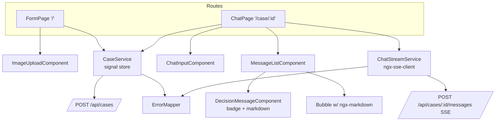
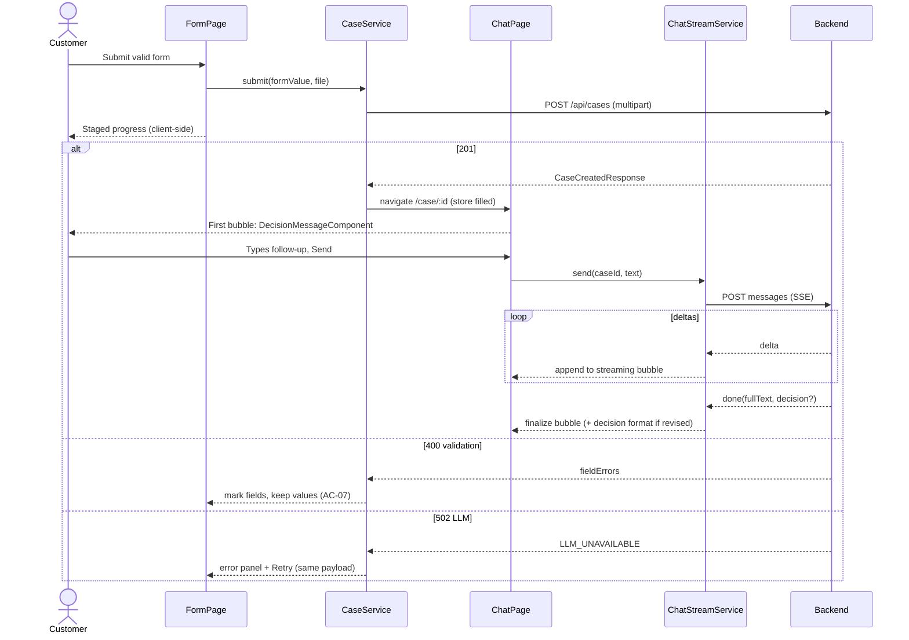

# ADR-003: Frontend — Angular + Angular Material

**Date:** 2026-07-14
**Status:** Accepted
**Relates to:** `docs/ADR/000-main-architecture.md`

---

## 1. Scope

The Angular SPA in `app/frontend`: project initialization, component/service structure, form UX, chat UX with SSE streaming, error states, and integration with the Spring Boot backend. Does NOT cover: endpoint semantics (ADR-001), prompts (ADR-002), persistence (ADR-004).

---

## 2. Context7 References

| Library | Context7 Handle | Used for |
|---|---|---|
| Angular | `/angular/angular` | Framework: standalone components, signals, reactive forms, HttpClient |
| Angular Material | `/angular/components` | Form controls, date picker, progress, snackbars, layout |
| ngx-markdown | `/jfcere/ngx-markdown` | Rendering agent markdown messages |
| ngx-sse-client | `/flauc/ngx-sse-client` | SSE over POST via HttpClient (native EventSource is GET-only) |

---

## 3. Component Design

### Project initialization

1. `ng new hsdc-frontend` with the current Angular CLI (Angular 22 line): standalone components (default), SCSS styles, routing enabled, into `app/frontend`.
2. `ng add @angular/material` — accept a prebuilt theme, enable typography and animations. This wires Material + CDK + theming in one step (the researched, officially supported path).
3. Add `ngx-markdown` and `ngx-sse-client` via npm.
4. Create `proxy.conf.json` mapping `/api` → `http://localhost:8080`, referenced by the dev-server config, so the SPA calls relative `/api/...` URLs and CORS never arises in development.
5. Commit the generated skeleton before feature work (same rule as backend).

### Structure (standalone components, no NgModules)

- **Routes:** `/` → FormPage, `/case/:id` → ChatPage (guarded: navigating to an unknown/stale id redirects to `/`, matching no-resume semantics).
- **FormPage** — the request form (PRD Screen 1). Reactive form; child **ImageUploadComponent** (file picker + drag-drop, client-side type/size validation, thumbnail preview with remove). Submitting delegates to CaseService and switches to the staged progress state; on success navigates to ChatPage passing the CaseCreatedResponse via router state / case store.
- **ChatPage** — PRD Screen 2. Header with case summary + New case (confirm dialog); **MessageListComponent** (bubbles; auto-scroll on new content); **DecisionMessageComponent** (decision badge, justification, next steps, disclaimer — rendered from markdown with the category supplied separately); **ChatInputComponent** (textarea + send, disabled while streaming per AC-21); typing indicator bubble while awaiting first delta.
- **Services:**
  - **CaseService** — POST multipart to `/api/cases`; holds the active case (id, summary, first message, decision) in a signal-based store; cleared on New case (no client persistence — reload loses state per AC-25).
  - **ChatStreamService** — wraps `ngx-sse-client`: POST message, expose the stream as delta/done/error to the page; enforces one in-flight message.
  - **ErrorMapper** — maps backend `code` values to user-facing texts and UI states (validation → inline; LLM_UNAVAILABLE → error panel/failed bubble; CASE_NOT_FOUND → redirect + snackbar).

### State management

Angular **signals** in the two services; no NgRx. All state is per-tab and ephemeral by design (PRD AC-25). Retry after pipeline failure reuses the still-held form value + file from FormPage state (AC-22, AC-07).

---

## 4. Data Structures

Frontend mirrors of the ADR-001 DTOs: CaseSubmission (form model), CaseCreatedResponse, ChatMessage view-model `{sender, content, status: pending|sent|failed, decisionCategory?}`, SSE event payloads (delta/done/error). The equipment-category list (AC-08) and the 2 request types are frontend constants matching backend enums — a mismatch fails loudly as a 400, caught by integration of the two enum sources in tests.

---

## 5. Interface Contracts

Consumes exactly the three backend endpoints (contract in ADR-001). Frontend-enforced mirrors of server rules (server remains authoritative):

- Submit disabled until required fields valid (AC-02/03/04); date picker `max` = today.
- File input accepts only `image/jpeg`, `image/png`; > 5 MB rejected client-side with the limit named (AC-05/06).
- One in-flight chat message; send disabled while pending (AC-21).
- New case → confirm dialog → store cleared → navigate `/` (AC-24).

---

## 6. Technical Decisions

### ngx-sse-client for streaming consumption
**Status:** Accepted
**Date:** 2026-07-14
**Context:** Chat replies stream over SSE from a **POST** endpoint. Native `EventSource` supports GET only and no bodies/headers. Researched options: `ngx-sse-client` (Angular-native, HttpClient-based, supports POST, Observable API), Microsoft's `fetch-event-source` (framework-agnostic, archived/low maintenance), hand-rolled fetch+ReadableStream parsing.
**Decision:** `ngx-sse-client` — purpose-built for Angular, goes through HttpClient (so dev-proxy and interceptors apply), Observable API fits the service design.
**Rejected alternatives:**
- `fetch-event-source`: archived repo, bypasses HttpClient/proxy/interceptors.
- Hand-rolled SSE parser: avoidable protocol code to test and maintain.
- Native EventSource + switching the endpoint to GET: message content in URLs (length limits, logs).
**Consequences:** (+) small, idiomatic integration; (−) an extra third-party dependency of modest popularity — mitigated by isolating it behind ChatStreamService (swap-out seam).
**Review trigger:** Library incompatibility with a future Angular major → replace inside ChatStreamService only.

### Chat UI from Material primitives + ngx-markdown (no chat component library)
**Status:** Accepted
**Date:** 2026-07-14
**Context:** Researched ready-made chat UIs (user request): Angular Material itself offers none; Syncfusion/DevExtreme are commercial; Nebular imports a competing design system; ngx-chat-ui and angular-material-chat-ui are stale community projects (details in ADR-000 §8).
**Decision:** Own thin components on Material primitives; agent markdown rendered by `ngx-markdown`; decision messages get a dedicated component with a Material-styled category badge.
**Rejected alternatives:** listed above (license, design-system clash, staleness).
**Consequences:** (+) exact PRD Screen-2 fidelity, no license/theming fights; (−) we own bubble layout, autoscroll, typing indicator (~small, well-understood code covered by component tests).
**Review trigger:** Chat feature growth (attachments, virtual scroll, reactions).

### Signals + services for state (no NgRx), ephemeral by design
**Status:** Accepted
**Date:** 2026-07-14
**Context:** Two screens, one active case, deliberate no-persistence (AC-25). Modern Angular defaults to signal-based reactivity.
**Decision:** Signal stores inside CaseService/ChatStreamService; router guard treats missing store state as "no case" → form.
**Rejected alternatives:** NgRx/store libraries (ceremony without payoff at this scope); sessionStorage persistence (contradicts AC-25's fresh-session-on-reload).
**Consequences:** (+) minimal, testable; (−) if session resume ever lands, a store refactor is needed (matches PRD deferral).
**Review trigger:** Session browsing/resume enters scope.

### Client-side staged progress (cosmetic)
**Status:** Accepted
**Date:** 2026-07-14
**Context:** PRD Screen 1 shows staged text ("Uploading photo…", "Analyzing image…", "Making decision…") but ADR-001 chose a single blocking pipeline request with no server progress events.
**Decision:** Stages are client-side timed/estimated while the one request is in flight; final stage holds until the response. The UI never claims a stage the server has objectively completed differently — texts are phrased as activity, not confirmation.
**Rejected alternatives:** SSE progress from the pipeline (rejected in ADR-001); a plain spinner (fails PRD's staged-text spec).
**Consequences:** (+) PRD UX with zero backend complexity; (−) stages are approximate.
**Review trigger:** Pipeline latency regularly > ~30 s making fake stages feel wrong → revisit ADR-001's progress-event alternative.

---

## 7. Diagrams

### Component Diagram

### Sequence Diagram — submit, navigate, stream

---

## 8. Testing Strategy

Angular CLI's default unit-test runner for the generated version; `HttpTestingController` for HTTP; component harnesses for Material controls. No E2E in MVP (user decision) — manual app run before commits per AGENTS.md.

### Test scenarios for this area

| Scenario | Type | Input | Expected output | Edge cases |
|---|---|---|---|---|
| Required-field gating | Component | empty form → fill stepwise | Submit enabled only when AC-02 satisfied | reason toggles with request type (AC-03) |
| Date picker bounds | Component | pick today / tomorrow | today ok; tomorrow blocked with inline message | timezone edge: "today" from local clock |
| File validation UX | Component | GIF, 6 MB JPEG, valid PNG | reject with named rule; reject with named limit; preview + remove shown | re-select after remove |
| Value preservation on 400 | Component + HttpTesting | server fieldErrors | fields keep values incl. file; errors inline | first invalid field scrolled into view |
| Staged progress + retry | Component + HttpTesting | delayed response; 502 | stages shown; error panel with Retry resends identical payload | "Back to form" restores filled form |
| First message rendering | Component | CaseCreatedResponse for each category | badge per category, justification, next steps, disclaimer rendered from markdown | orderVerified=false note visible (AC-15) |
| Streaming render | Service + Component (mock SSE observable) | delta sequence + done | progressive text; input disabled during stream; finalized bubble | done carries revised decision → decision formatting (AC-20) |
| Failed chat message | Service + Component | error event | bubble marked failed + Resend; history intact (AC-23) | resend success clears failed state |
| Stale case guard | Router test | navigate /case/unknown with empty store | redirect `/` + notice | CASE_NOT_FOUND from backend mid-chat → same handling |
| New case flow | Component | click New case | confirm dialog → store cleared → form empty (AC-24) | cancel keeps chat |

### Technical acceptance criteria

- TAC-003-01: `ng test` passes headless on the course VM with no watch mode.
- TAC-003-02: `ng build` production build succeeds with zero errors; `ng lint` reports no errors.
- TAC-003-03: With the backend running, `ng serve` + proxy serves the full flow with no CORS errors and no absolute `http://localhost:8080` URL anywhere in `src/`.
- TAC-003-04: Both screens render usably at 375 px and 1280 px widths (responsive check, manual or viewport unit test).
- TAC-003-05: Every backend error `code` in ADR-001 has a mapped UI behavior in ErrorMapper (exhaustiveness test).
