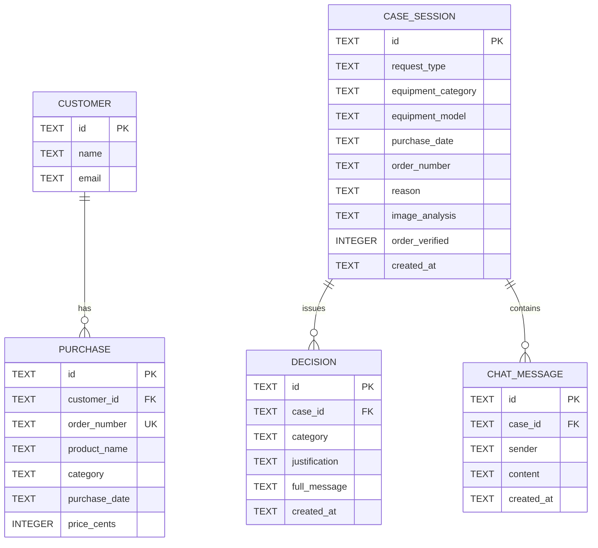

# ADR-004: Persistence — SQLite Session Store & Seeded Customer Data

**Date:** 2026-07-14
**Status:** Accepted
**Relates to:** `docs/ADR/000-main-architecture.md`

---

## 1. Scope

The local SQLite database: schema, initialization/seeding, repository design over `JdbcClient`, durability, and failure tolerance. Does NOT cover: the in-memory ActiveCaseRegistry (ADR-001), what triggers writes (ADR-001/002), UI (ADR-003).

---

## 2. Context7 References

| Library | Context7 Handle | Used for |
|---|---|---|
| SQLite JDBC (xerial) | `/xerial/sqlite-jdbc` | JDBC driver, connection URL options |
| Spring Framework | `/spring-projects/spring-framework` | `JdbcClient`, transactions, SQL init scripts |

---

## 3. Component Design

- **Datasource:** single SQLite file at `HSDC_DB_PATH` (default `./data/hsdc.db`), JDBC URL `jdbc:sqlite:<path>`; directory auto-created on startup. Connection pool capped at **1 connection** (SQLite single-writer; avoids `SQLITE_BUSY` entirely at MVP concurrency). WAL journal mode enabled via connection settings for durability + reader/writer friendliness.
- **Schema management:** Spring SQL init (`schema.sql` + `data.sql`, always-run) with **idempotent** DDL (`CREATE TABLE IF NOT EXISTS`) and idempotent seeding (`INSERT OR IGNORE` keyed on fixed IDs). No Flyway — two scripts, one app, local file (decision below).
- **Repositories** (one per aggregate, `JdbcClient`, hand-written SQL): `CaseSessionRepository` (insert; update image-analysis field), `DecisionRepository` (insert; latest-by-case query for tests/debug), `ChatMessageRepository` (insert; list-by-case), `PurchaseRepository` (read-only: find purchase + customer by order number).
- **Write path & failure tolerance:** all repository calls that record session data are invoked through a small `SessionRecorder` facade that wraps each write in try/catch-log (AC-29) so callers (`CaseService`, `ChatService`) contain no persistence error handling. Reads (purchase lookup) propagate errors normally — a failed lookup is treated as "not found + warning log" per AC-15's spirit, keeping the flow alive.
- **Transactions:** each logical write (e.g. case + first decision + first message after pipeline success) runs in one Spring transaction, so a crash cannot persist half a case footer; individual chat-turn writes are single-statement.

---

## 4. Data Structures

SQLite schema (conceptual columns; types map to SQLite's TEXT/INTEGER; all timestamps ISO-8601 TEXT in UTC):

- **case_session** — id (TEXT PK, UUID), request_type (TEXT, CHECK in COMPLAINT|RETURN), equipment_category (TEXT), equipment_model (TEXT), purchase_date (TEXT date), order_number (TEXT NULL), reason (TEXT NULL), image_analysis (TEXT), order_verified (INTEGER 0/1/NULL for not-provided), created_at (TEXT).
- **decision** — id (TEXT PK), case_id (TEXT FK → case_session), category (TEXT, CHECK in APPROVE|REJECT|NEEDS_MORE_INFO), justification (TEXT), full_message (TEXT), created_at (TEXT). Index on (case_id, created_at).
- **chat_message** — id (TEXT PK), case_id (TEXT FK), sender (TEXT, CHECK in CUSTOMER|AGENT), content (TEXT), created_at (TEXT). Index on (case_id, created_at).
- **customer** — id (TEXT PK), name (TEXT), email (TEXT). Seeded, read-only.
- **purchase** — id (TEXT PK), customer_id (TEXT FK), order_number (TEXT UNIQUE), product_name (TEXT), category (TEXT), purchase_date (TEXT), price_cents (INTEGER). Seeded, read-only.

Seed data: ~5 customers, ~10 purchases spanning the interesting policy boundaries — inside/outside the 14-day return window, inside/outside 24-month warranty, and a purchase whose date mismatches typical form input (exercises the agent's cross-check ability). Order numbers documented in `data.sql` comments for manual demo use.

Foreign keys enforced (SQLite `foreign_keys` pragma on). The uploaded image itself is **not** stored (decision below) — only its analysis text.

---

## 5. Interface Contracts

Repository operations consumed by other packages:

| Operation | Input | Output | Errors |
|---|---|---|---|
| insertCase | CaseSession record | void | via SessionRecorder → logged only |
| updateCaseAnalysis | caseId, analysis text, orderVerified | void | logged only |
| insertDecision | Decision record | void | logged only |
| insertMessage | ChatMessage record | void | logged only |
| findPurchaseByOrderNumber | order number string | PurchaseInfo (with customer) or empty | DataAccessException → caught by CustomerService → treated as miss + WARN |

`PurchaseInfo`: customer name, order number, product name, category, purchase date, price — exactly what the decision prompt's history block needs (ADR-002).

---

## 6. Technical Decisions

### Spring SQL init scripts instead of Flyway
**Status:** Accepted
**Date:** 2026-07-14
**Context:** Schema must exist and seeds must load on first start; records must survive restarts (AC-30). The user already chose plain JDBC over JPA.
**Decision:** `schema.sql`/`data.sql` with fully idempotent statements, run on every start. Two small files, no migration-tool dependency, obvious to course participants.
**Rejected alternatives:**
- Flyway: versioned migrations are the right call the moment schema *evolves in production*; this MVP has one machine, one file, disposable data — the tool's ceremony outweighs its benefit here.
- Hibernate `ddl-auto`: no Hibernate in the project (JDBC decision).
**Consequences:** (+) zero extra deps, trivially inspectable; (−) future schema changes need hand-written idempotent ALTERs or a later Flyway adoption (records may then be legally discarded — course data).
**Review trigger:** First real schema change after data worth keeping exists, or a second environment appears → adopt Flyway then.

### Single-connection pool + WAL mode
**Status:** Accepted
**Date:** 2026-07-14
**Context:** SQLite allows one writer; default multi-connection pools produce intermittent `SQLITE_BUSY` under concurrent writes (chat turn + case creation).
**Decision:** Pool max = 1 and WAL journal mode. Serializes all DB access; with sub-millisecond writes and single-user load, contention is nil, and AC-30 durability holds.
**Rejected alternatives:** Default pool of 10 + busy-timeout tuning: fixing a concurrency problem we don't need to have.
**Consequences:** (+) no busy errors, simple mental model; (−) DB access is a global serial point — irrelevant at MVP scale, first thing to revisit at real load.
**Review trigger:** Any multi-user deployment → move to server DB (PostgreSQL) rather than tuning SQLite.

### Uploaded images are not persisted
**Status:** Accepted
**Date:** 2026-07-14
**Context:** AC-26 requires persisting form fields + analysis result; it does not require the photo. Photos of customer property are the most privacy-sensitive artifact in the system.
**Decision:** Store only the image analysis text. The compressed image lives in memory for the case's active lifetime (registry) and is discarded.
**Rejected alternatives:** BLOB column (bloats a "local audit" DB, raises retention/privacy questions the PRD hasn't answered); file storage on disk (same questions + path management).
**Consequences:** (+) lean DB, smaller privacy surface; (−) an auditor sees the model's description, not the pixels — flagged in PRD terms as acceptable for MVP.
**Review trigger:** Audit/compliance requirement to retain original evidence, or the session-browsing feature lands.

### UUIDs generated in the application
**Status:** Accepted
**Date:** 2026-07-14
**Context:** IDs must be known before/independently of the insert (case id returns to the frontend even if persistence failed per AC-29).
**Decision:** Application-generated UUID strings for all PKs; DB has no autoincrement dependency.
**Rejected alternatives:** SQLite rowid/autoincrement: couples id issuance to a write that is allowed to fail.
**Consequences:** (+) AC-29-compatible id flow, trivially testable; (−) 36-char keys (irrelevant here).
**Review trigger:** None foreseeable within scope.

---

## 7. Diagrams

### Entity-Relationship Diagram



Note: `CASE_SESSION.order_number` is a plain recorded value, intentionally **not** a foreign key to `PURCHASE` — unverified orders must be storable (AC-15).

### Sequence Diagram — failure-tolerant recording

```mermaid
sequenceDiagram
    participant CS as CaseService
    participant SR as SessionRecorder
    participant R as Repositories
    participant DB as SQLite

    CS->>SR: recordCaseCreated(case, decision, firstMessage)
    SR->>R: tx { insertCase; insertDecision; insertMessage }
    R->>DB: 3 INSERTs (one transaction)
    alt success
        DB-->>SR: ok
    else any failure
        DB-->>R: error
        R-->>SR: exception
        SR->>SR: log ERROR with caseId
        Note over SR,CS: no exception propagates (AC-29)
    end
    SR-->>CS: returns normally either way
```

---

## 8. Testing Strategy

Repository tests run against a **temp-file SQLite database** (not the dev file), created fresh per test class via the same schema.sql — this validates the real dialect, driver, and scripts, not a substitute DB.

### Test scenarios for this area

| Scenario | Type | Input | Expected output | Edge cases |
|---|---|---|---|---|
| Schema idempotency | Integration | run schema.sql + data.sql twice on same file | no errors, no duplicate seeds | AC-30 restart semantics |
| Case round-trip | Integration | insertCase then raw SELECT | all columns match incl. NULL order_number, tri-state order_verified | reason NULL for returns |
| Decision ordering | Integration | 3 decisions, distinct timestamps | latest-by-case returns the newest | equal timestamps → deterministic tiebreak (id) |
| Message round-trip | Integration | customer + agent messages | list-by-case ordered by created_at, senders correct | long content (10k chars) |
| Purchase lookup | Integration | seeded order number; unknown; NULL | PurchaseInfo with customer; empty; empty | case-sensitivity of order numbers defined + tested |
| FK enforcement | Integration | decision with bogus case_id | constraint violation | pragma foreign_keys verified ON |
| SessionRecorder tolerance | Unit | repository mock throws | no exception to caller; ERROR logged with caseId | partial tx rollback: no orphan rows after forced mid-tx failure |
| Restart durability | Integration | write, close datasource, reopen same file | rows present (AC-30) | WAL checkpoint on close |
| Concurrent writes | Integration | parallel chat-message inserts (2 threads) | all rows present, no SQLITE_BUSY | pool-of-1 serialization proven |

### Technical acceptance criteria

- TAC-004-01: Fresh checkout + `mvnw spring-boot:run` creates `./data/hsdc.db` with all 5 tables and seed rows; second run changes nothing (row counts identical).
- TAC-004-02: All repository integration tests pass against real SQLite temp files; none use an in-memory substitute of a different engine (no H2).
- TAC-004-03: `data.sql` contains seed purchases covering: within 14 days, outside 14 days, within 24 months, outside 24 months (verified by a test asserting these date properties relative to a fixed seed reference date documented in the file).
- TAC-004-04: Deleting the DB file while the app is stopped and restarting yields a working app with fresh seeds (documented recovery path).
- TAC-004-05: No SQL statement in the codebase concatenates user input — all parameters bound (static check/test over repository sources).
