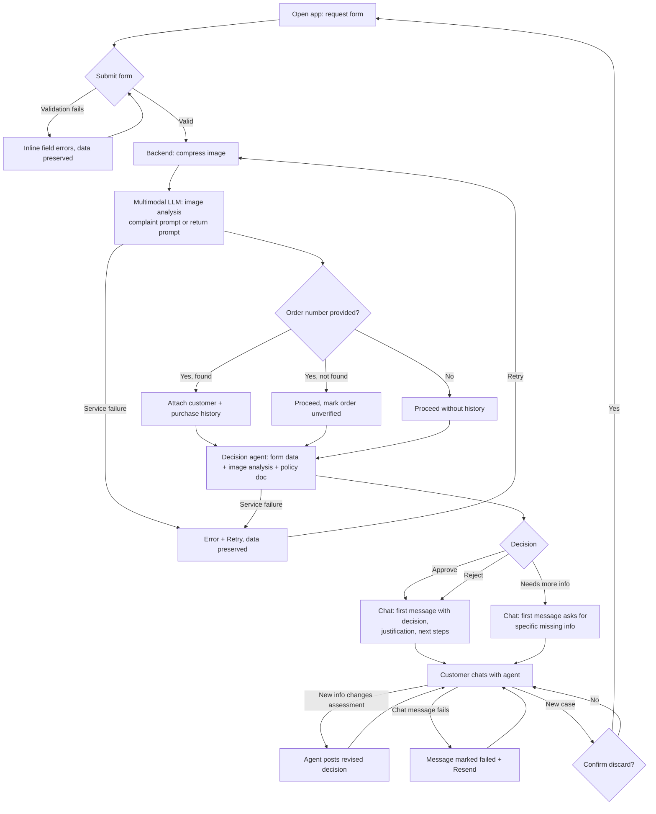

# PRD — Hardware Service Decision Copilot (MVP)

---

## 1. Executive Summary

Hardware Service Decision Copilot is a self-service web application for end customers of an electronics retailer. The customer submits a complaint or return request through a form (including a photo of the equipment), a multimodal LLM analyzes the photo, and an AI agent issues a decision (Approve / Reject / Needs more info) with a clear justification based on the company's complaint and return policies. The customer can then discuss the decision with the agent in a chat interface, and the agent may revise the decision based on new information. Every session — form data, decisions, and chat messages — is persisted in a local database for audit purposes. This document specifies the MVP.

---

## 2. Problem Statement

Complaint and return requests for electronics are today handled manually by customer support and hardware service staff. Each case requires an employee to read the customer's description, inspect photos, check the purchase date against policy windows, and apply return/complaint rules — a repetitive, error-prone process with long response times. Customers wait hours or days for an initial decision that, in most cases, follows directly from written policy. There is no consistent, immediate, policy-grounded first response available to the customer at the moment they submit a request.

---

## 3. Users / Personas

### Persona 1 — Retail customer with a defective device (complaint)
Bought a laptop 8 months ago; the screen shows dead pixels. Wants to know quickly whether the defect is covered by warranty and what happens next. Expects a clear decision, an understandable justification, and concrete next steps — not legal jargon.

### Persona 2 — Retail customer returning an unwanted purchase (return)
Bought wireless headphones 5 days ago, unopened or barely used, and changed their mind. Wants confirmation that the return will be accepted and instructions on how to ship the item back. Expects the process to take minutes, not days.

### Persona 3 — Customer with an ambiguous case
Has a phone with a cracked screen and claims it "cracked by itself". The photo alone cannot prove the cause. Expects to be told what additional information or evidence is needed rather than being rejected without explanation.

---

## 4. Main Flows

### 4.1 Happy path — Return request approved

1. Customer opens the application and sees the request form.
2. Customer selects request type **Return**, selects an equipment category, enters the equipment name/model, picks the purchase date, optionally enters an order number, optionally enters a reason, and uploads one photo of the equipment.
3. Customer submits the form. The UI shows a loading state ("Analyzing your request…").
4. The system validates the input (required fields, image format JPEG/PNG, image size ≤ 5 MB).
5. The backend compresses the image and sends it to the multimodal LLM with the **return analysis prompt** (judge whether the item shows no damage and no signs of usage, and whether it could be resold).
6. If an order number was provided, the backend looks up the customer and purchase history in the customer database. If found, this data is added to the agent's context; if not found, the case proceeds without it.
7. The decision agent receives: form data, the image analysis result, the **return policy document**, and (if available) customer/purchase data. It produces a decision (**Approve**) with justification and next steps, using the **return decision prompt**.
8. The UI switches to the chat view. The first chat bubble (from the agent) contains: a greeting, the decision, the justification, and next steps — formatted with headings/lists.
9. Customer asks follow-up questions in the chat; the agent answers with full context (form data, image analysis, decision, conversation history).
10. Throughout the session, the system persists a session record: the submitted form data, image analysis result, every decision issued, and every chat message, each with a timestamp.
11. Customer clicks **New case** at any time to leave the current session (its record remains stored) and return to an empty form.

### 4.2 Complaint request — rejected

1–4. As in 4.1, but the customer selects request type **Complaint**. The reason field is required and the form cannot be submitted without it.
5. The backend compresses the image and sends it to the multimodal LLM with the **complaint analysis prompt** (judge whether the item is damaged, what kind of damage, and what could have caused it).
6. As in 4.1.
7. The decision agent uses the **complaint policy document** and the **complaint decision prompt**. The image analysis indicates mechanical damage consistent with a drop, which the policy excludes from warranty. The agent returns **Reject** with a justification citing the policy rule and next steps (e.g. paid repair option).
8–11. As in 4.1.

### 4.3 Ambiguous case — needs more info, decision revised in chat

1–7. As in 4.1/4.2, but the image analysis is inconclusive (e.g. the photo is blurry, or the visible damage does not determine the cause). The agent returns **Needs more info**, stating exactly what is missing (e.g. "a sharp photo of the charging port").
8. The first chat bubble explains what additional information is needed.
9. Customer provides the missing information as a text message in the chat.
10. The agent re-evaluates with the new information and posts a revised decision (Approve or Reject) with justification. The latest decision in the conversation is the valid one.

### 4.4 Error path — unusable image

1–5. As above, but the multimodal LLM reports that the image does not show electronics equipment or is unusable (too dark, unrelated object).
6. The agent returns **Needs more info** asking the customer to describe the item's condition or start a new case with a better photo. The flow continues in the chat as in 4.3.

### 4.5 Error path — service failure

1–5. As above, but the LLM service call fails (timeout, provider error) at either the image-analysis or decision step.
6. The UI shows an error message ("We couldn't process your request. Please try again.") with a **Retry** action. The entered form data and uploaded image are preserved so the customer does not re-enter anything.
7. Retry re-runs processing from the failed step.

### 4.6 Validation error path

1. Customer submits the form with a missing required field, a file that is not JPEG/PNG, or a file larger than 5 MB.
2. The form is not submitted to processing. The invalid fields are highlighted with a specific inline message per field (e.g. "Image must be JPEG or PNG, max 5 MB"). Entered data is preserved.

---

## 5. User Stories

- **US-1 (happy path, return):** As a customer returning an unused product, I want to submit the product details and a photo and immediately get a decision with return instructions, so that I don't wait days for a manual review.
- **US-2 (happy path, complaint):** As a customer with a defective device, I want to describe the defect and upload a photo and get a policy-based warranty decision with justification, so that I understand whether and how my device will be repaired or replaced.
- **US-3 (ambiguous case):** As a customer whose case cannot be decided from the photo alone, I want the agent to tell me exactly what additional information it needs and to revise its decision after I provide it, so that my case is not unfairly rejected.
- **US-4 (invalid input):** As a customer who uploads a wrong file or skips a required field, I want a specific inline error message without losing my entered data, so that I can correct the mistake quickly.
- **US-5 (service failure):** As a customer whose request fails due to a technical problem, I want a clear error message and a retry option that keeps my data, so that I don't have to fill in the form again.
- **US-6 (follow-up chat):** As a customer who received a decision, I want to ask follow-up questions in a chat where the agent remembers my case details, so that I don't have to repeat information.
- **US-7 (purchase lookup):** As a returning customer, I want to provide my order number so the system can verify my purchase, so that my case is decided using confirmed purchase data instead of only what I typed.
- **US-8 (new case):** As a customer with a second device to report, I want a "New case" button that starts a fresh form, so that cases don't mix.
- **US-9 (session record):** As the company operating the service, I want every session — form data, decisions, and chat messages — persisted in a local database, so that cases can be audited and disputed decisions can be reviewed later.

---

## 6. Acceptance Criteria

### Form
- **AC-01** The form contains exactly these fields: request type (select: Complaint | Return), equipment category (select from predefined list), equipment name/model (text), purchase date (date picker), order number (text, optional), reason (textarea), image upload (single file).
- **AC-02** Request type, equipment category, equipment name/model, purchase date, and image are required; the form cannot be submitted while any of them is empty.
- **AC-03** The reason field is required when request type = Complaint and optional when request type = Return; the requirement indicator updates immediately when the request type changes.
- **AC-04** The purchase date cannot be in the future; selecting a future date blocks submission with an inline message.
- **AC-05** Only one image can be uploaded; formats other than JPEG/PNG are rejected client-side and server-side with the message naming the allowed formats.
- **AC-06** Images larger than 5 MB are rejected client-side and server-side with a message naming the 5 MB limit.
- **AC-07** After a validation error, all previously entered field values (including the selected file) are preserved.
- **AC-08** The equipment category list contains at least these options: Smartphone, Laptop, Tablet, TV / Monitor, Audio, Peripherals, Gaming console, Smart home, Other.

### Image analysis
- **AC-09** The backend compresses/downscales the uploaded image before sending it to the multimodal LLM; the payload sent to the LLM is smaller than the original upload for images above the compression threshold.
- **AC-10** For request type = Complaint, the image analysis uses a complaint-specific prompt that instructs the model to judge whether the item is damaged, the damage type, and plausible causes.
- **AC-11** For request type = Return, the image analysis uses a return-specific prompt that instructs the model to judge whether the item shows no damage and no signs of usage and whether it is resellable.

### AI decision
- **AC-12** Every decision is exactly one of: Approve, Reject, Needs more info.
- **AC-13** The decision prompt for a complaint injects the complaint policy document; the decision prompt for a return injects the return policy document; the two prompts are separate.
- **AC-14** The agent's context for the decision includes: all form field values, the image analysis result, and — when the order number matched a record — the customer's purchase history.
- **AC-15** An order number that matches no record does not block processing; the decision is made without purchase history and the first message states that the order could not be verified.
- **AC-16** Every decision message contains a distinct justification section referencing at least one concrete policy rule, and a next-steps section.
- **AC-17** If the image analysis reports the image as unusable or not showing electronics equipment, the decision is Needs more info and the message states what a usable photo must show.

### Chat
- **AC-18** After submission succeeds, the UI shows a chat view whose first message is from the agent and contains: greeting, decision (visually distinguished), justification, and next steps.
- **AC-19** The customer can send free-text messages; each agent reply is generated with the full conversation history plus the form data and image analysis in context.
- **AC-20** When the customer provides information that changes the assessment, the agent posts a new decision message in the same format as the first one; the most recent decision message is the valid decision of the case.
- **AC-21** While an agent reply is being generated, the UI shows a visible pending indicator and blocks sending a second message until the reply arrives or fails.

### Errors and lifecycle
- **AC-22** If an LLM/service call fails during form processing, the UI shows an error message with a Retry action; Retry reprocesses without the customer re-entering any data.
- **AC-23** If an LLM/service call fails during chat, the failed message is marked as failed and can be resent; the conversation history is not lost.
- **AC-24** A "New case" action is available in the chat view; activating it starts a fresh form; the previous session's stored record is unaffected.
- **AC-25** Reloading the page starts a fresh UI session (form data, image, and chat are not restored); previously persisted session records remain in the database. Session resume is not part of the MVP.

### Session persistence
- **AC-26** Every successful form submission creates a persisted session record containing all form field values, the image analysis result, and a creation timestamp.
- **AC-27** Every decision (initial and revised) is persisted with its category (Approve / Reject / Needs more info), justification text, and timestamp, linked to its session.
- **AC-28** Every chat message (customer and agent) is persisted with its sender, content, and timestamp, linked to its session.
- **AC-29** A persistence failure is logged but does not block or interrupt the customer-facing flow.
- **AC-30** Session records survive an application restart.

### General
- **AC-31** All UI texts and agent responses are in English.
- **AC-32** Every decision message includes the disclaimer that the decision is an automated recommendation and does not limit the customer's statutory rights.

---

## 7. Out of Scope

- **User accounts / authentication** — no login, no registration; anonymous single-session use.
- **Session browsing and resume** — sessions are persisted for record-keeping, but there is no UI to list, view, or resume past sessions; a page reload starts a fresh session.
- **RAG knowledge base** — no internal knowledge base of electronics specifications or extended procedures; the agent's only policy sources are the two injected policy documents.
- **Admin or employee UI** — no back-office view, case queue, or human-review workflow.
- **Notifications** — no email, SMS, or push messages.
- **Payments and refund execution** — the system decides and instructs; it does not process refunds or generate shipping labels.
- **Multilingual support** — English only.
- **Mobile applications** — responsive web only; no native apps.
- **Multiple images or video upload** — exactly one image per case.
- **Editing a submitted form** — corrections happen via chat or a new case.

---

## 8. Constraints

### Business
- Decisions must be grounded exclusively in the two company policy documents; the agent must not invent policy rules.
- Every decision must carry the disclaimer that it is an automated recommendation and does not limit the customer's statutory consumer rights.
- The agent must not commit the company to compensation, amounts, or deadlines beyond what the policy documents state.

### Functional
- Image upload: exactly 1 file, JPEG or PNG, maximum 5 MB.
- The backend compresses the image before any LLM call.
- Decision categories: Approve, Reject, Needs more info — no other values.
- Language: English (UI and agent output).
- Customer/purchase lookup is keyed by order number only; lookup miss must not block the flow.
- Every session (form data, image analysis result, decisions, chat messages) is persisted to a local database; persistence is write-only from the customer's perspective (no read-back UI).
- Target: current versions of desktop and mobile browsers (responsive layout).

### External document / data references

| Document | File path | When it is used |
|---|---|---|
| Return policy | `docs/policies/return-policy.md` | Injected into the decision prompt when request type = Return |
| Complaint policy | `docs/policies/complaint-policy.md` | Injected into the decision prompt when request type = Complaint |
| Sample customer/purchase data | seeded database (see ADR) | Order-number lookup during form processing |

---

## 9. UI Description (wireframe level)

### Screen 1 — Request form

- Single-page form, one column, titled with the product name and a one-line explanation of what the tool does.
- Fields top to bottom: request type (select, 2 options), equipment category (select), equipment name/model (text input with placeholder e.g. "ThinkPad X1 Carbon Gen 11"), purchase date (date picker, future dates disabled), order number (text input, marked optional, with a hint that it enables purchase verification), reason (textarea; label and required-marker switch with request type per AC-03), image upload (file picker + drag-and-drop area stating "JPEG/PNG, max 5 MB, one photo showing the item's condition").
- After image selection: thumbnail preview with file name and a remove (×) control.
- Submit button at the bottom; disabled while required fields are empty.
- **Validation errors:** inline message under each invalid field; the first invalid field is scrolled into view.
- **Loading state:** on submit, the form is replaced by a full-area progress indicator with staged text ("Uploading photo…", "Analyzing image…", "Making decision…"); no user input possible.
- **Service failure state:** error panel with the failure message and a Retry button (per AC-22); a secondary "Back to form" link returns to the filled-in form.

### Screen 2 — Chat view

- Header: product name, a compact case summary line (request type, category, model, purchase date), and a **New case** button.
- Message list: agent messages left-aligned, customer messages right-aligned. The first agent message renders rich formatting: greeting line, a visually distinguished decision badge/heading (Approve / Reject / Needs more info), justification section, next-steps list, and the disclaimer line.
- Revised decisions (AC-20) render in the same rich format as the first message.
- Input row at the bottom: text field + Send button. Send disabled while the agent reply is pending (AC-21); pending indicator shown as a typing/loading bubble.
- **Failed message state:** a failed customer message shows an error marker and a "Resend" affordance (AC-23).
- **Empty state:** not applicable — the chat always opens with the agent's first message.
- **Navigation:** New case → confirmation prompt ("This will end the current case") → empty form (Screen 1). The ended session's record remains stored.

---

## 10. User Flow Diagram

---

## 11. Agent / System Behavior Specification

### Role and purpose
The agent is an automated complaint/return decision assistant. It evaluates a single case against the company's return or complaint policy, communicates a decision with justification, answers follow-up questions about the case, and revises the decision when new information warrants it.

### Allowed
- Issue and revise decisions (Approve / Reject / Needs more info) for the current case, always with justification referencing the applicable policy document.
- Ask the customer for specific additional information needed to decide.
- Explain policy rules, next steps, and the meaning of its decision in plain language.
- Use the verified purchase history (when available) to confirm or contradict form data — e.g. purchase date mismatches.

### Not allowed
- Invent policy rules, warranty terms, deadlines, or amounts not present in the injected policy documents.
- Commit the company to compensation or exceptions beyond policy.
- Provide legal advice or interpret consumer law beyond the mandatory disclaimer.
- Discuss other customers, other cases, or internal company information.
- Answer off-topic requests (see below).
- Change the decision without stating the new justification.

### Decision categories and communication
| Decision | When | Message must contain |
|---|---|---|
| Approve | Case clearly satisfies the applicable policy | What was approved, policy basis, concrete next steps (e.g. shipping instructions) |
| Reject | Case clearly violates the applicable policy | The specific policy rule violated, what the customer can do instead (e.g. paid repair), next steps |
| Needs more info | Evidence is insufficient or contradictory, or the image is unusable | Exactly what information or photo is missing and why it is needed |

### Mandatory disclaimer
Every decision message (initial and revised) ends with: *"This is an automated recommendation based on our published policies. It does not limit your statutory consumer rights."*

### Off-topic handling
For questions unrelated to the current complaint/return case (weather, coding help, other products, company gossip), the agent politely states it can only help with the current case and restates what it can do. It does not answer the off-topic question, even partially.

### Ambiguity handling
When the agent cannot decide from available evidence, it must return Needs more info rather than guessing. If the customer cannot provide the requested evidence, the agent explains that the case will be decided on available evidence and issues the decision the policy dictates for unproven claims.

### Language and tone
English. Professional, empathetic, concise. No legal jargon without a plain-language explanation. Formatted output: short paragraphs, headings or bold labels for decision/justification/next steps, lists for step sequences.

---

## 12. Further Notes

- **Assumption:** the customer database with purchase history is read-only sample data seeded for the MVP; its schema and storage are ADR decisions.
- **Assumption:** "compression" acceptance (AC-09) is functional only — target size/quality parameters are ADR decisions.
- **Given decision (product owner):** session persistence uses a **local SQLite database**; schema and access details are ADR decisions.
- **Open question for ADR:** retention period for persisted session records (MVP assumes indefinite retention on the local database).
- **Deferred (explicitly out of MVP, planned later):** session browsing/resume, RAG knowledge base, authentication.
- **Open question for ADR:** whether image analysis and decision are one LLM call chain or two separate model calls (PRD assumes two logical steps; implementation may combine them if all ACs still hold).
- The two policy documents referenced in Section 8 are first versions created alongside this PRD and are expected to evolve; the decision prompts must treat them as the single source of policy truth.
