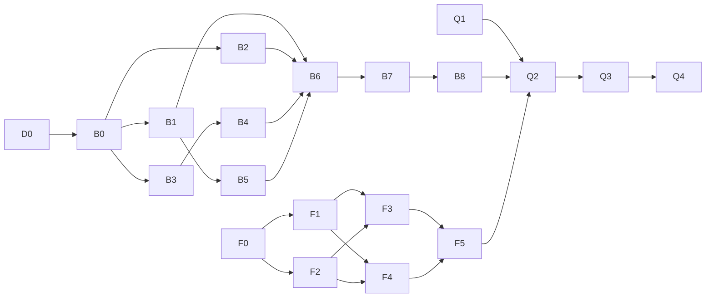

# Implementation Plan — HSDC Proof of Concept (multi-agent orchestration)

## Context

The Hardware Service Decision Copilot (HSDC) is fully specified — `docs/PRD.md` (32 ACs), `docs/ADR/000–004`, `docs/design-guidelines.md` (Play brand) — but `app/` is an empty scaffold. This plan builds a fully working PoC: Spring Boot backend, Angular frontend, Play-branded UI, unit + integration tests, TDD throughout, one focused commit per step.

**The orchestrator (main session) implements nothing.** All work is delegated to `be-developer`, `fe-developer`, and `qa-engineer` subagents. Each task below defines the exact, self-sufficient context pack the agent receives so it never needs to ask questions.

**User decisions baked into this plan (2026-07-15):**
- **No E2E tests at all** — not even a manual-only nuance changes this: no automated Playwright suite is written. qa-engineer performs *manual* Playwright-MCP verification with screenshots and defect reports only.
- **English UI, Java 21/Spring Boot 3.5.x backend, Angular 22 frontend** — the PRD/ADRs win over the agent definitions (which wrongly assume TypeScript + Polish). Every delegated prompt explicitly overrides this.
- **Manual QA checkpoint after every major step** — after each milestone, the app is validated live via Playwright MCP: open it, screenshot every screen/state, fill and submit the form, walk the flow, and compare screenshots against the Play brand reference (`assets/homepage.png` + `docs/design-guidelines.md`). See §2a "QA checkpoints".

---

## 1. Standing orchestration rules

### 1.1 Mandatory override block (prepended to EVERY agent prompt)

> Your agent definition assumes TypeScript and Polish UI text. **That is wrong for this project.** Authoritative decisions: backend = Java 21 + Spring Boot 3.5.x + Maven (`app/backend`), frontend = Angular 22 + Angular Material (`app/frontend`), ALL user-facing text in **English** (PRD AC-31). Test file conventions follow the stack (JUnit `*Test.java` / Jasmine `*.spec.ts`), not `*.test.ts`.
> Never print, log, or commit the value of `OPENROUTER_API_KEY`. Never read `.env*` files.
> Do not push to remote. Commit only your own paths (listed below) with explicit `git add <paths>` — never `git add -A`.

### 1.2 Path ownership (conflict prevention)

| Agent | May write | Read-only |
|---|---|---|
| be-developer | `app/backend/**`, `docs/ADR/**` (only when a task says so) | everything else |
| fe-developer | `app/frontend/**` | `assets/**`, `docs/**` |
| qa-engineer | `docs/qa/**` | everything else (may *run* both apps) |

Two agents may run in parallel **only** when their write paths are disjoint (BE lane ∥ FE lane ∥ QA-docs task). If a `git index.lock` collision occurs during simultaneous commits, the agent waits 5 s and retries once.

### 1.3 Standard TDD block (included in every implementation prompt)

1. Write the tests for this task FIRST (from the spec excerpts given in the prompt).
2. Run them; confirm they fail for the expected reason.
3. Implement the minimum code to pass.
4. Run the full verification for your app (`1.4`); fix until green.
5. Refactor only while green. Report honestly — if something fails, say so.

### 1.4 Verification commands (per lane, required before every commit)

- **Backend:** `.\mvnw.cmd verify` (PowerShell) / `./mvnw verify` (Git Bash) in `app/backend`. Integration tests must never touch the real network — the SDK base URL points at WireMock (TAC-001-01).
- **Frontend:** in `app/frontend`: `npm test -- --watch=false --browsers=ChromeHeadless`, `ng lint`, `ng build`. If ChromeHeadless is missing, set `CHROME_BIN` to the Playwright-installed Chromium.
- **Commit format:** `Backend: …` / `Frontend: …` / `QA: …` / `Docs: …` — one logical change per commit.

### 1.5 Context-pack protocol

Each task prompt contains ONLY: the override block (1.1), the task goal + deliverables, the exact files/sections to read (never "read all docs"), verbatim excerpts where the agent must not paraphrase (API contracts, disclaimer text, token values), the TDD block, verification command, commit message, and path boundaries. Nothing else — no full PRD dumps.

### 1.6 Library documentation

Agents have the Context7 MCP configured, but its API key failed earlier in this project. Instruct agents: try `resolve-library-id`/`query-docs` first; on auth error, fall back to official docs via WebFetch (spring.io, angular.dev, github.com/openai/openai-java). ADR Context7 handles are marked unverified — do not trust them blindly.

---

## 2. Phases and tasks

### Phase D — Documentation alignment (be-developer) — no dependencies, run first or parallel

**D0 — Fix three doc discrepancies found in review**
- ADR-001: §5 says oversized upload → `413`, its own sequence diagram says `400`. Resolve: multipart limit exception is caught and returned as **HTTP 400, code `IMAGE_TOO_LARGE`** (update §5 text to match diagram).
- ADR-003 §3: after "`ng add @angular/material` — accept a prebuilt theme", append: theme is then replaced by a **custom Play theme** per `docs/design-guidelines.md` (task F1).
- `docs/README.md`: fix filename `PRD-Product-Requirements-Document.md` → `PRD.md`; `plans/` now exists.
- Context pack: `docs/ADR/001-backend-spring-boot.md` §5 + §7 diagram, `docs/ADR/003-frontend-angular.md` §3 step 2, `docs/README.md`. No tests (docs only).
- Commit: `Docs: align ADR-001 upload error status, ADR-003 Play theme note, README paths`

### Phase B — Backend lane (be-developer, strictly sequential B0→B8)

**B0 — Spring Boot skeleton** *(no deps)*
- Generate via Spring Initializr REST API: Maven, latest Boot **3.5.x**, Java **21**, group `com.jsystems`, artifact `hsdc-backend`, package `com.jsystems.hsdc`, deps: Web, Validation, JDBC, Actuator. `curl`/`wget`/PowerShell downloads are **denied** on this VM — download `https://start.spring.io/starter.zip?...` with a small **Python** script (`urllib.request` + `zipfile`; python is allowlisted), extract into `app/backend`. Fallback: `scoop install maven` then `mvn archetype`/manual pom per ADR-001 §3. Set `<maven.compiler.release>21</maven.compiler.release>` (VM has JDK 25).
- Commit 1: `Backend: Spring Initializr skeleton (Boot 3.5.x, Java 21)` — skeleton as-is (ADR-001 rule).
- Then add manual deps: `org.xerial:sqlite-jdbc`, `com.openai:openai-java` (4.x), `net.coobird:thumbnailator`, `org.wiremock:wiremock` (test scope). Verify `mvnw verify` passes (empty test run OK).
- Commit 2: `Backend: add sqlite-jdbc, openai-java, thumbnailator, wiremock dependencies`
- Context pack: ADR-001 §3 "Project initialization" (verbatim), ADR-000 §3 repo structure.

**B1 — Persistence layer** *(deps: B0)*
- `schema.sql` + `data.sql` (idempotent: `CREATE TABLE IF NOT EXISTS`, `INSERT OR IGNORE`), 5 tables per ADR-004 §4 ERD; seeds: ~5 customers, ~10 purchases spanning policy boundaries (within/outside 14 days and 24 months, one date-mismatch case; document order numbers in comments). Datasource: `jdbc:sqlite:${HSDC_DB_PATH:./data/hsdc.db}`, Hikari pool max **1**, WAL mode, `foreign_keys=ON`, auto-create parent dir. Repositories over `JdbcClient`: CaseSession, Decision, ChatMessage, Purchase(+customer join). `SessionRecorder` facade: every write wrapped in try/catch-log (AC-29), transactional case+decision+message write. App-generated UUID string PKs.
- Tests FIRST per ADR-004 §8 table (all 9 scenario rows; temp-file SQLite, **no H2**).
- Context pack: `docs/ADR/004-persistence-sqlite.md` (whole file), PRD AC-26..AC-30 verbatim, ADR-000 §5 data models.
- Commit: `Backend: SQLite persistence layer with idempotent schema, seeds and SessionRecorder`

**B2 — Image module** *(deps: B0; independent of B1)*
- `ImageService`: validate content type (JPEG/PNG only) and size (≤ 5 MB); compress via Thumbnailator: longest edge ≤ **1568 px**, JPEG quality 80; smaller images pass through except PNG > 1 MB → re-encode JPEG. Corrupt data → validation error.
- Tests FIRST: ADR-001 §8 "Compression behavior" row + format/size unit cases; generate test images programmatically (`BufferedImage`).
- Context pack: ADR-001 §3 ImageService bullet + §6 "Image compression target" (verbatim), PRD AC-05/06/09 verbatim.
- Commit: `Backend: image validation and Thumbnailator compression service`

**B3 — Policy module** *(deps: B0)*
- `PolicyService`: loads `return-policy.md` + `complaint-policy.md` from `HSDC_POLICIES_DIR` (default `../../docs/policies`) at startup, caches, **fails startup with a readable message if missing** (TAC-001-04).
- Tests FIRST: loads both, caches, missing-file startup failure.
- Context pack: ADR-001 §3 PolicyService bullet, ADR-000 §7 env-var table row.
- Commit: `Backend: policy document loader with fail-fast startup`

**B4 — LLM module** *(deps: B3)*
- Singleton OpenAI SDK client built explicitly: `baseUrl` = `OPENROUTER_BASE_URL` (default `https://openrouter.ai/api/v1`), `apiKey` = `OPENROUTER_API_KEY`, timeout 120 s, maxRetries 2. Do NOT rely on the SDK's `OPENAI_*` env auto-detection.
- 4 prompt templates as classpath resources: `complaint-analysis`, `return-analysis`, `complaint-decision`, `return-decision` — content requirements per ADR-002 §3 (policy verbatim placeholder, PRD §11 decision rules, prohibitions, tone) and the **mandatory disclaimer verbatim**: *"This is an automated recommendation based on our published policies. It does not limit your statutory consumer rights."*
- `LlmService`: `analyzeImage` (vision model, base64 data-URL image part + text part), `decide` (JSON-schema structured output: `category` enum APPROVE|REJECT|NEEDS_MORE_INFO + `message`; one fresh retry on schema violation, then exception — never guess), `streamChat` (streaming, trailing decision-marker line parsed and stripped). Models from `HSDC_VISION_MODEL` (default `openai/gpt-4o-mini`) / `HSDC_DECISION_MODEL` (default `openai/gpt-4o`) — validate defaults against the live OpenRouter catalog; if deprecated, pick nearest equivalents and update ADR-002 + ADR-000 §7.
- Tests FIRST: all 8 rows of ADR-002 §8 (WireMock at the SDK base URL; no real network; TAC-002-01..05 incl. key-never-logged assertion).
- Context pack: `docs/ADR/002-llm-integration-openrouter.md` (whole file), PRD §11 verbatim, PRD AC-10..17 verbatim, note that PolicyService (B3) provides policy text.
- Commit: `Backend: LLM service with OpenRouter Chat Completions, prompts and structured decisions`

**B5 — Customer lookup + ActiveCaseRegistry** *(deps: B1)*
- `CustomerService.findByOrderNumber` → `PurchaseInfo` or empty; `DataAccessException` caught → miss + WARN (AC-15 spirit). `ActiveCaseRegistry`: concurrent map caseId → case context (form data, analysis, message list), idle TTL 2 h eviction.
- Tests FIRST: hit/miss/exception-as-miss; registry register/get/append/evict.
- Context pack: ADR-001 §3 registry bullet + state-management paragraph, ADR-004 §5 interface table, PRD AC-14/15 verbatim.
- Commit: `Backend: customer lookup service and in-memory active case registry`

**B6 — Case pipeline + web layer** *(deps: B1,B2,B3,B4,B5)*
- `CaseService` pipeline: validate → compress → analyzeImage → lookup → decide → register → persist via SessionRecorder (failure-tolerant). `CaseController` `POST /api/cases` (multipart, blocking, 201 `CaseCreatedResponse {caseId, decision, firstMessage, orderVerified}`). `GlobalExceptionHandler` + error contract: `VALIDATION_ERROR`(400, fieldErrors), `IMAGE_TOO_LARGE`(400, names 5 MB limit; multipart limits 5 MB file/6 MB request), `LLM_UNAVAILABLE`(502), `CASE_NOT_FOUND`(404), `INTERNAL`(500). DTO validation per ADR-001 §4 (reason required iff COMPLAINT, no future dates, category enum per AC-08).
- Tests FIRST: ADR-001 §8 rows 1–5 + 8 (MockMvc + WireMock), ADR-000 §10 scenarios 1–5 + 8; boundary 5.0 MB ok / 5.01 MB rejected (TAC-001-05).
- Context pack: ADR-001 §4+§5 verbatim (contract is shared with FE — must not drift), ADR-000 §6, PRD AC-01..08, AC-12..17, AC-22, AC-26..29 verbatim.
- Commit: `Backend: case submission pipeline, REST endpoint and error contract`

**B7 — Chat service + SSE** *(deps: B4,B5,B6)*
- `ChatService`: persist customer message → assemble context from registry → `streamChat` → forward deltas to `SseEmitter` (named events `delta`/`done`/`error` per ADR-001 §4) → parse revision marker → persist agent message (+ decision row if revised). `ChatController` `POST /api/cases/{id}/messages`: 404 for unknown/evicted case, 400 validation (content 1..2000), **409** on concurrent in-flight reply. Mid-stream failure → one `error` event, partial text NOT persisted.
- Tests FIRST: ADR-001 §8 rows 6–9; ADR-000 §10 scenarios 6–7.
- Context pack: ADR-001 §3 ChatService bullet + §5 SSE contract verbatim, ADR-002 §3 streamChat + marker decision, PRD AC-18..21, AC-23, AC-27/28 verbatim.
- Commit: `Backend: chat SSE streaming endpoint with decision revision detection`

**B8 — Health, config defaults, full backend gate** *(deps: B6,B7)*
- `/api/health` (Actuator mapped or thin controller). Config tests: with env unset → documented defaults; set → overrides (TAC-002-03). Full `mvnw verify` green. Boot smoke: start the app (key already in VM env), assert `/api/health` = UP and `./data/hsdc.db` created idempotently (TAC-004-01), then stop it. Update backend `README.md` (run instructions, env vars table from ADR-000 §7 — do not create/edit `.env*` files).
- Commit: `Backend: health endpoint, config default tests and run instructions`

### Phase F — Frontend lane (fe-developer, strictly sequential F0→F5; entire lane parallel to Phase B)

The FE lane never calls the real backend during development — it builds against the **verbatim ADR-001 contract** (pasted into prompts) with HttpTestingController / mock SSE observables. This is what makes B ∥ F safe.

**F0 — Angular skeleton** *(no deps)*
- `npx @angular/cli@latest new hsdc-frontend` in `app/frontend` (standalone, SCSS, routing), `ng add @angular/material` (any prebuilt theme — replaced in F1), `npm i ngx-markdown ngx-sse-client`, `proxy.conf.json` mapping `/api` → `http://localhost:8080` wired into serve config. If `ngx-sse-client` is incompatible with Angular 22, note it and hand-roll a `fetch`+ReadableStream SSE parser inside ChatStreamService later (ADR-003 names this seam) — do not block.
- Commit 1: `Frontend: Angular 22 skeleton with Angular Material` (generated as-is); Commit 2: `Frontend: add ngx-markdown, ngx-sse-client and dev proxy config`
- Context pack: ADR-003 §3 "Project initialization" verbatim.

**F1 — Play brand theme** *(deps: F0)*
- Custom Material theme from `assets/design-tokens.json` + `docs/design-guidelines.md`: primary `#6C43BF`, Manrope from Google Fonts (weights **500/600/700**; base weight 500), body 14 px, radius 7 px on buttons (10.5 px cards), 3.5 px spacing rhythm, text `#1F1F1F`, backgrounds `#FFFFFF`/`#F5F5F5`. Copy `assets/logo.svg` + `assets/favicon.ico` into the app (`public/`), app header with logo per logo-usage rules. Magenta `#E6144B`/yellow `#FFF200` reserved for badges/highlights only — never body text.
- Verification: `ng build` + a style smoke spec (theme compiles, header renders logo).
- Context pack: `docs/design-guidelines.md` (whole file), `assets/design-tokens.json` path, ADR-003 §3.
- Commit: `Frontend: custom Play brand Material theme, Manrope typography and logo`

**F2 — API models + core services** *(deps: F0)*
- TS interfaces mirroring ADR-001 §4 exactly: CaseSubmission, `CaseCreatedResponse {caseId, decision, firstMessage, orderVerified}`, ChatMessage view-model `{sender, content, status: pending|sent|failed, decisionCategory?}`, SSE events `delta|done|error`, `ErrorResponse {code, message, fieldErrors?}`. Constants: equipment categories (AC-08 list verbatim), request types. `CaseService` (multipart POST, signal store, cleared on New case), `ChatStreamService` (ngx-sse-client wrapper, one in-flight message), `ErrorMapper` (exhaustive over codes `VALIDATION_ERROR|IMAGE_TOO_LARGE|LLM_UNAVAILABLE|CASE_NOT_FOUND|INTERNAL` — TAC-003-05).
- Tests FIRST: HttpTestingController for CaseService; mock SSE observable for ChatStreamService; ErrorMapper exhaustiveness.
- Context pack: ADR-001 §4+§5 verbatim, ADR-003 §3 services + §4, PRD AC-08 list verbatim.
- Commit: `Frontend: API models, case and chat stream services with error mapper`

**F3 — FormPage + ImageUploadComponent** *(deps: F1,F2)*
- Reactive form per PRD Screen 1 (§9): all AC-01 fields, required rules AC-02, reason toggles with request type AC-03, date max = today AC-04, file accept JPEG/PNG ≤ 5 MB with named-limit messages AC-05/06, thumbnail + remove, drag-and-drop, values preserved on error AC-07, first invalid field scrolled into view. Staged progress (client-side cosmetic: "Uploading photo…" → "Analyzing image…" → "Making decision…"), error panel + Retry (resends identical payload) + "Back to form". On 201 → navigate `/case/:id`.
- Tests FIRST: ADR-003 §8 rows 1–5.
- Context pack: PRD §9 Screen 1 verbatim + AC-01..08, AC-22 verbatim; ADR-003 §3 FormPage + §6 staged-progress decision; ADR-001 error codes.
- Commit: `Frontend: request form with validation, image upload and staged progress`

**F4 — ChatPage suite** *(deps: F1,F2)*
- Per PRD Screen 2 (§9): header (case summary + New case with confirm dialog → clear store → `/`), MessageListComponent (agent left / customer right, autoscroll), DecisionMessageComponent (category badge — suggested Play-palette mapping: APPROVE `#6C43BF`, REJECT `#E6144B`, NEEDS_MORE_INFO `#707070`; justification, next steps, disclaimer; markdown via ngx-markdown), ChatInputComponent (send disabled while pending AC-21, typing bubble), streaming render from ChatStreamService, revised decision rendered as decision format (AC-20), failed message + Resend (AC-23), route guard: unknown/stale id or empty store → redirect `/` + snackbar (also on `CASE_NOT_FOUND` mid-chat).
- Tests FIRST: ADR-003 §8 rows 6–10.
- Context pack: PRD §9 Screen 2 verbatim + AC-18..21, AC-23..25 verbatim; ADR-003 §3 ChatPage + §6 decisions; SSE event contract from ADR-001 §4 verbatim; design-guidelines Components section.
- Commit: `Frontend: chat view with streaming, decision messages and new case flow`

**F5 — Frontend gate** *(deps: F3,F4)*
- Full `ng lint` + `ng test` + `ng build` green; responsive check 375 px / 1280 px (TAC-003-04); assert no absolute `http://localhost:8080` in `src/` (TAC-003-03); fix anything found.
- Commit (only if changes): `Frontend: lint, build and responsive fixes for MVP gate`

### Phase 2a — Recurring QA checkpoints (qa-engineer, after every major step)

Standing rule (user, 2026-07-15): after every major milestone, qa-engineer performs a **live manual validation via Playwright MCP** — start whatever is runnable, open it in the browser, take a screenshot of every reachable screen/state, fill and submit the form where applicable, follow the flow end-to-end, and **compare each screenshot against the Play reference** (`assets/homepage.png` visual reference + `docs/design-guidelines.md` tokens: purple `#6C43BF` CTAs, Manrope 500, 7 px radius, white canvas, logo usage). Findings land in `docs/qa/checkpoints/QC-n.md` with screenshots in `docs/qa/checkpoints/shots/`; blocking findings become defects fixed by the owning lane **before that lane's next step starts**.

| Checkpoint | Trigger (after) | What is validated live |
|---|---|---|
| QC-1 | F1 | `ng serve`: app shell renders, Play theme/logo/typography vs `homepage.png` side-by-side comparison |
| QC-2 | F3 | Form screen: all AC-01 fields, validation UX (bad file, future date, missing reason for Complaint), staged progress on submit (backend may be absent → expect the error panel + Retry, which is itself AC-22 behavior to verify) |
| QC-3 | F4 ∧ F5 | Chat screen reachable with mocked/route state; decision badge, bubbles, input gating, New case dialog; responsive 375/1280 px screenshots |
| QC-4 | B8 | Backend alone: `/api/health` UP; `POST /api/cases` exercised via Playwright `browser_network_request` (or curl-free scripted call) with a QA test image → 201 + decision JSON; SQLite rows present |
| QC-5 | B8 ∧ F5 (= entry gate to Q2) | Full stack: form → submit → real decision → chat round-trip; screenshot every step; brand comparison on both screens |

Q2 then deepens QC-5 into the full flow matrix (4.1–4.6). Each checkpoint commit: `QA: checkpoint QC-n results and screenshots`.

Orchestrator sequencing: checkpoints QC-1..3 run inside the FE lane's serial order (fe-developer pauses while qa-engineer validates); QC-4 likewise for BE. This keeps the "validate before the next step" rule without cross-lane blocking — the BE lane never waits for an FE checkpoint or vice versa.

### Phase Q — QA lane (qa-engineer)

**Q1 — Test plan + test assets** *(no deps — runs parallel to B/F lanes)*
- `docs/qa/test-plan.md`: manual test procedure mapping PRD flows 4.1–4.6 and AC-01..32 to concrete steps + expected results; TAC checklist (TAC-01..06, TAC-001/002/003/004 series). `docs/qa/assets/`: test images generated with Python (valid JPEG, valid PNG, >5 MB JPEG, a GIF, a tiny/unusable image; Pillow if available, else pure-bytes minimal files).
- **Explicit instruction: NO automated E2E tests — manual verification only (user decision 2026-07-15, overrides your agent definition's Phase 2).**
- Context pack: PRD §4 + §6 verbatim, ADR-000 §10 TAC list, ADR-001/002/003/004 TAC sections (list only), design-guidelines Colors/Components tables.
- Commit: `QA: manual test plan and generated test assets`

**Q2 — Integrated smoke round 1** *(deps: B8, F5, Q1)*
- Start backend (`mvnw spring-boot:run`; `OPENROUTER_API_KEY` already in VM env — never print it) and frontend (`ng serve` with proxy). Drive the app via **Playwright MCP**: execute test-plan steps for flows 4.1 (return approve — use a seeded in-window order number from `data.sql` comments), 4.2 (complaint reject), 4.3 (needs-more-info + chat revision), 4.4 (unusable image), 4.6 (validation errors), plus New case (AC-24), reload (AC-25), restart durability spot-check (AC-30 — check `data/hsdc.db` rows survive backend restart). Screenshot each step; compare visuals against `docs/design-guidelines.md` (purple CTAs, Manrope, 7 px radius, logo). Real OpenRouter calls are expected here (TAC-03 manual latency check < 30 s p95).
- Output: `docs/qa/defects-round-1.md` — each defect: severity, steps to reproduce, expected (with AC/TAC reference), actual, screenshot path.
- Commit: `QA: smoke test round 1 results and defect report`

**Q3 — Defect fixes** *(deps: Q2; orchestrator triages)*
- Orchestrator reads the defect report, assigns each defect to be-developer or fe-developer as its own small task: context pack = the defect entry verbatim + the relevant AC + pointer to the owning module. TDD: reproduce as a failing unit/integration test first, then fix. One commit per defect or per coherent defect group (`Backend: fix …` / `Frontend: fix …`).

**Q4 — Regression + final report** *(deps: Q3)*
- Re-run the failed test-plan items + spot-check the previously passing critical path. `docs/qa/final-report.md`: AC-by-AC pass/fail matrix, TAC checklist result, screenshots, known limitations.
- Commit: `QA: regression round and final MVP verification report`
- If defects remain: loop Q3→Q4 once more (orchestrator decides based on severity).

---

## 3. Dependency matrix

| Task | Agent | Depends on | Can run in parallel with |
|---|---|---|---|
| D0 | be-developer | — | F0, Q1 |
| B0 | be-developer | D0 (same agent, serial) | F0–F5, Q1 |
| B1 | be-developer | B0 | FE lane, Q1 |
| B2 | be-developer | B0 | FE lane, Q1 |
| B3 | be-developer | B0 | FE lane, Q1 |
| B4 | be-developer | B3 | FE lane, Q1 |
| B5 | be-developer | B1 | FE lane, Q1 |
| B6 | be-developer | B1,B2,B3,B4,B5 | FE lane, Q1 |
| B7 | be-developer | B4,B5,B6 | FE lane, Q1 |
| B8 | be-developer | B6,B7 | FE lane, Q1 |
| F0 | fe-developer | — | BE lane, Q1 |
| F1 | fe-developer | F0 | BE lane, Q1 |
| F2 | fe-developer | F0 | BE lane, Q1 |
| F3 | fe-developer | F1,F2 | BE lane, Q1 |
| F4 | fe-developer | F1,F2 | BE lane, Q1 |
| F5 | fe-developer | F3,F4 | BE lane, Q1 |
| Q1 | qa-engineer | — | everything before Q2 |
| Q2 | qa-engineer | B8, F5, Q1 | — (exclusive: runs live apps) |
| Q3 | be-dev + fe-dev | Q2 | BE-fixes ∥ FE-fixes (disjoint paths) |
| Q4 | qa-engineer | Q3 | — |

Within a lane tasks are serial (one agent, shared build files). Across lanes B/F/Q1 run concurrently. The B↔F contract freeze point is **ADR-001 §4–§5** — any contract change during implementation must go through the orchestrator, who updates the other lane's next prompt.

QA checkpoints slot in as: QC-1 after F1, QC-2 after F3, QC-3 after F5, QC-4 after B8, QC-5 before Q2 (see §2a) — each blocks only its own lane's next step.

Estimated commits: ~25 (2×B0, B1–B8, D0, 2×F0, F1–F5, QC-1..5, Q1, Q2, Q3 fixes ×N, Q4).

---

## 4. Risks and mitigations

| Risk | Mitigation |
|---|---|
| Initializr zip download blocked (curl/wget/PS denied) | Python `urllib` download (allowlisted); fallback `scoop install maven` + manual pom per ADR-001 §3 |
| Context7 MCP auth error (seen earlier) | Agents fall back to official docs via WebFetch; ADR handles marked unverified |
| `ngx-sse-client` incompatible with Angular 22 | Isolated behind ChatStreamService (ADR-003 seam) → hand-rolled fetch/ReadableStream parser |
| Karma ChromeHeadless missing on VM | `CHROME_BIN` → Playwright Chromium |
| Default models (`openai/gpt-4o*`) deprecated on OpenRouter | B4 validates against live catalog, updates ADR-002/000 + defaults |
| Angular dev-proxy buffers SSE | Q2 verifies streaming visibly; if buffered, fe-developer adds proxy `ws/flush` config fix as a Q3 defect |
| Parallel commits hit `.git/index.lock` | Path-scoped `git add`, wait-and-retry once; orchestrator staggers lane completions |
| Agent context drift (TS/Polish defaults) | Mandatory override block (1.1) in every prompt |

---

## 5. End-to-end verification (definition of done)

1. `app/backend`: `mvnw verify` green; no test touches the real network; fresh checkout + run creates `data/hsdc.db` with seeds idempotently; `/api/health` UP with only `OPENROUTER_API_KEY` set.
2. `app/frontend`: `ng test`, `ng lint`, `ng build` green; no hardcoded backend URL; renders at 375/1280 px.
3. Live smoke (Q2/Q4): PRD flows 4.1–4.4 + 4.6 pass through the real stack with real OpenRouter; decision messages carry badge, justification, next steps and the verbatim disclaimer; New case, reload and restart-durability behave per AC-24/25/30; UI matches Play design tokens on screenshots.
4. `docs/qa/final-report.md` shows AC-01..32 matrix with no open critical defects; all five QC checkpoint reports exist with screenshots and Play-brand comparisons.
5. Every step committed with its focused message; `OPENROUTER_API_KEY` value appears nowhere in the repo or logs.
